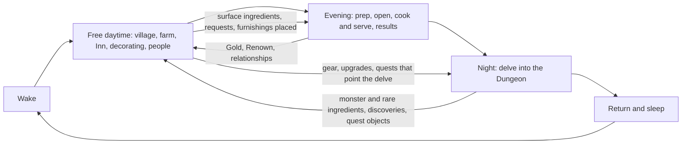
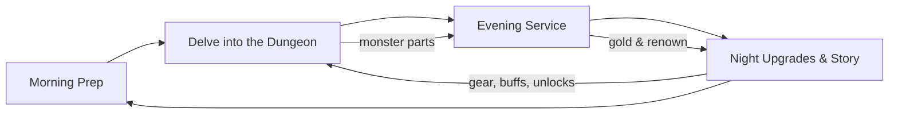

# HEARTHDELVE — Project Design Document

*Working title. Version 0.5 (village life-sim direction: daily loop, Brackenford's villagers and Visitors, the Inn, farming, ranching and fishing, the surface and dungeon ingredient model; Stronghold and defense direction dropped, 2026-10-04; learning priorities, tavern customization, decor rewards, worker customization, 2026-10-04; design philosophy, tavern immersion, quests and relationships in v0.3, 2026-10-03; top-down pivot in v0.2, 2026-10-02). Engine: Unity 6.6, moving to 6.7 LTS on release.*

> **About this version.** Version 0.1 described a side-scrolling game in the style of Dead Cells. On 2026-10-02 the game pivoted to top-down. Sections rewritten for the pivot are marked **(rewritten in v0.2)**; the text they replace is kept in [Appendix B](#appendix-b-superseded-v01-side-scroller-design) rather than deleted. Sections and lines added in v0.3 are marked **(added in v0.3)** or *(v0.3)*, those added in v0.4 **(added in v0.4)** or *(v0.4)*, and those added or rewritten in v0.5 **(added in v0.5)**, **(rewritten in v0.5)** or *(v0.5)*; they record design direction and do not widen any milestone's approved scope (the roadmap in Section 11.1 says what each milestone builds). Sections without a mark are unchanged from v0.1. Version 0.5 moves the game's identity toward a fantasy life sim centred on the tavern; the Stronghold direction and the old day order it replaces are kept in [Appendix C](#appendix-c-superseded-v04-stronghold-direction-and-day-order). Where this document and `CLAUDE.md` disagree, `CLAUDE.md` wins.

---

## 1. Overview

### 1.1 Elevator Pitch (rewritten in v0.5)

**Experience target:** *Live in a strange fantasy village, grow and gather ingredients, run and personalize your tavern and inn, build relationships with villagers and visitors, and descend into the dungeon at night for things the surface world cannot provide.*

You inherit the Sunken Flagon, a tavern and inn in the small frontier village of Brackenford, built over the mouth of an ancient dungeon. Your days are your own: tend a garden plot and a few animals, fish, shop, decorate the tavern and its guest rooms, run errands and get to know the odd, warm people who live here (the kind of village where an elderly skeleton might keep bees and nobody finds that strange). In the evening you open the doors, cook and serve: some of the faces at the tables are your neighbours, others are Visitors passing through, and a few of those Visitors may take a room upstairs and, if you help them, settle into one of the village's empty plots. When the tavern closes, you descend into **the Dungeons**, fighting room by room through top-down, hack-and-slash runs for monster parts, rare and magical ingredients, strange discoveries and things your neighbours asked you to find. Then you come home, sleep, and the next day begins.

The dungeon is still a major pillar, but it is one part of a broader daily life rather than the whole game with a tavern between runs. *(The v0.2 pitch, built around a home that grows into a fortified Stronghold, is in Appendix C.)*

### 1.2 Genre and Inspirations (rewritten in v0.5)

Hybrid: a top-down fantasy life sim centred on owning and running a tavern and inn, with a top-down action roguelite dungeon beneath it.

| Inspiration | What we take from it |
|---|---|
| *Stardew Valley* *(v0.5)* | The overall shape: a free daytime in a small village whose residents you come to know, growing and gathering your own ingredients, a day that ends in sleep. Not a template: its mechanics (crops, seasons, the clock, gifting) are not copied automatically (Section 13) |
| *Cult of the Lamb* | Short top-down combat runs feeding a home that grows; residents with personalities. *(v0.5: no longer the overall shape; the home is a tavern, inn and village, not a cult compound or fortress)* |
| *Hades* | Combat feel: 8-direction movement, dodge with i-frames, light combo plus a heavy/charged attack; room-by-room runs where you pick the next room by its reward |
| *Moonlighter* | A shopkeeper who delves; what you carry out of the dungeon is what you sell. *(v0.5: the order is now tavern in the evening, dungeon at night)* |
| *Dave the Diver* | Minigame-driven cooking and service, a limited "oxygen" resource (our Essence), charming NPC cast |
| *Delicious in Dungeon* | Monsters as food, the ecology and "cookability" of creatures, how you kill something affecting how it tastes |
| *Warcraft / Lord of the Rings* | Classic high-fantasy world: humans, dwarves, elves, orcs, ancient evils, kingdoms under threat |

### 1.3 Design Pillars

1. **Every kill is a harvest.** Combat is not only about survival; *how* you fight determines what you bring home.
2. **The surface and the depths, one life.** *(rewritten in v0.5)* Village life, the tavern and the dungeon feed each other. The surface provides dependable ingredients, people and a home; the dungeon provides what the surface can't: monster and magical ingredients, discoveries and stories. No part should feel like a detour from the "real" game.
3. **A home and a community that grow with you.** *(rewritten in v0.5)* The Sunken Flagon grows into a larger tavern, inn and home inside a village whose people know Bram, some of whom are there because of him. *(It no longer grows into a fortified Stronghold; Appendix C.)*
4. **Cozy on the surface, dread below.** The warmth of the village and the tavern, warm, funny and a little strange, contrasts with the menace of the depths.
5. **You can feel it.** *(added in v0.2)* Every important moment lands through visuals, sound and haptics together.
6. **Your tavern, your hands.** *(added in v0.3)* Tavern immersion: running the Sunken Flagon should feel physical and present. You walk the room, work the stations, carry the plates and watch strange monster parts become recognizable dishes. Immersion serves the fun and is never an excuse for busywork (Section 6.5).
7. **A home you made.** *(added in v0.4)* The Sunken Flagon increasingly becomes a place the player personally created: they choose how it looks and how it works, and fill it with things they bought, earned and dragged up from the dungeon. "This is my tavern. I chose how it looks, I earned the strange things inside it, and the room itself tells the story of what I've done" (Section 6.6).

### 1.4 Target Platform and Audience

- **Primary:** PC (Steam), plus a web build kept working throughout development. **Secondary:** Nintendo Switch 2, PlayStation 5, Xbox Series (post-launch consideration).
- **Input:** Controller-first design, full keyboard and mouse support.
- **Audience:** Players who enjoy cozy life sims, management games and action roguelites; fans of *Stardew Valley*, *Dave the Diver*, *Cult of the Lamb*, *Hades*, *Moonlighter*, *Potion Craft*.
- **Rating target:** Teen (fantasy violence, mild monster gore played for comedy).

### 1.5 Design Philosophy (added in v0.3)

The goal is not systems that work correctly; it is the experience the player has. A system can be bug-free and balanced on paper and still fail if it isn't fun, understandable or satisfying in play. The final test is always the experience in play.

**Questions for a non-trivial design decision**

- What experience is this supposed to create for the player, and which parts of it are essential?
- Does the mechanic actually create that experience in play?
- Is it fun, understandable and satisfying, rather than merely technically correct?
- Does it create curiosity, meaningful choices, challenge, mastery or surprise?
- Does it support good pacing and flow?
- Is the complexity producing interesting decisions, or merely more work?
- Does the player get clear and satisfying feedback?
- Does it reinforce Hearthdelve's theme, world and other systems?
- Can the idea be tested cheaply before we commit to a large build?

**Lenses as perspectives, not rules.** Jesse Schell's *The Art of Game Design: A Book of Lenses* is the project's recurring vocabulary for questioning a design. Schell presents each lens as a different way of looking at a design, and that is how we use them: pick the lenses that reveal something about the problem in front of us. No feature has to satisfy every lens, and a lens is never a box to tick. When an important design choice is proposed, it states the player experience it targets and, where useful, the lens or principle behind it; but the argument has to stand on its own, and "Schell says so" is not a reason. (The book is reference material only and is not kept in the repository.)

Where each lens most often matters in Hearthdelve:

| Lens | Where it tends to bite |
|---|---|
| Essential Experience | The start of every feature: the satisfying kill-and-harvest, the busy evening service, a rare dish carried out to the table, a neighbour you know walking in to eat |
| Fun | Whether a moment is enjoyable, not only correct: hits, minigames, serving |
| Curiosity | Rooms behind doors, unfamiliar monster parts, Test Kitchen experiments, Old Tamsin's disappearance |
| Problem Solving | Planning a delve around what the menu needs; routing service through a busy room |
| Elemental Tetrad | Checking that mechanics, story, aesthetics and technology pull the same way (a dish's preparation, its icon, its sound and its lore) |
| Flow | Minigame length and difficulty; service pacing; the rhythm of fights and choices in a delve |
| Challenge | Enemy telegraphs and fairness; timing windows; patience under load |
| Meaningful Choices | Room rewards, satchel space, the Lockbox, the menu, which part to cook and which to sell |
| Reward | Harvest quality, dish results, Renown, story beats, relationship moments |
| Simplicity/Complexity | Preferring emergent complexity (simple rules that interact) over innate complexity (more rules); see "Meaningful complexity" below |
| Elegance | One system serving several purposes, as Essence is both the delve timer and the health pool |
| Balance | The economy, the risk of going deeper, staff quality against the player's; tuning lives in ScriptableObjects so it can move |
| Visible Progress | The tavern and inn growing and changing; preparation depth rising with rarer dishes; familiar faces returning; empty plots becoming neighbours' homes |
| Feedback | Every action answering the player in visuals, sound and haptics (Section 9A) |
| Juiciness | Hits, flips, pours and plating that feel good simply to do |
| Interest Curve | The shape of a delve, an evening and an act, with peaks for bosses and signature dishes |
| Character / Character Web | Gundra, Pip, Ser Aldric, Sylvaris, Grukka and the regulars, and how they relate to Bram and each other (Section 2.7) |
| World | Aldmere, Brackenford and the dungeons' ecology: why monsters are edible, who lives in the village, why Visitors come |
| Playtesting | The final judge (below) |
| Technology | Choosing tools that serve the experience, and not letting a tool's shape dictate the design |

**Playtesting over theory.** Hearthdelve keeps its prototype-and-playtest approach: every sub-milestone step is playtested before the next. A theoretically elegant design that feels bad in play is not a successful design. For uncertain or expensive ideas:

1. identify the desired experience;
2. identify the smallest version that can test it;
3. build only that much;
4. playtest it;
5. analyze specifically what felt good or bad, and why;
6. iterate.

Player feedback is interpreted, not blindly obeyed. What players actually experience and do matters more than the solution they suggest.

**Meaningful complexity over system count.** Hearthdelve is not judged by how many mechanics it has. It already combines action combat, roguelite runs, harvesting, inventory and freshness, cooking minigames, tavern service, economy and upgrades, quests, relationships and story, and the v0.5 direction adds village life, farming, ranching, fishing and the Inn, so a smaller number of systems that interact richly beats many isolated ones. Before adding a rule or subsystem, ask:

- Does it create new decisions?
- Does it interact with existing systems?
- Does it serve more than one purpose?
- Does it strengthen the essential experience?
- Could an existing system do the same thing more elegantly?

Nothing is added only because another RPG or management game has it.

**Immersion and convenience.** Tavern immersion is a pillar, but immersion is a preference, not permission to create tedium. When the two conflict, neither extreme wins automatically; the question is what experience the interaction actually produces. Section 6.5 has the details.

**Learning priorities** *(added in v0.4)*. Hearthdelve is meant to become a finished, coherent game, and it is also a deliberate way for its designer to practise the parts of game development they most enjoy:

1. interactive dialogue writing;
2. building and tavern customization;
3. cooking minigames;
4. funny, strange, memorable NPC interactions;
5. persistent NPC relationships and reactivity;
6. top-down action combat.

*(v0.5)* The village life-sim direction strengthens all six: daytime gives dialogue, relationships and funny NPC moments a place to live outside service, the Inn extends customization, farming and fishing feed the kitchen, and the dungeon keeps combat purposeful by sending the player down for things people actually want.

This shapes where complexity and content budget go. In these areas the goal is **not always the smallest number of systems or pieces of content**: depth, iteration, experimentation and variety have value of their own. A large furnishing catalog, several distinct cooking minigames and elaborate premium recipes, substantial dialogue and reactivity for important characters, and lots of amusing contextual NPC moments are all welcome. When one of these pillars has two viable options, the smaller one is not chosen automatically for being smaller: prefer the option that makes the more useful and enjoyable design experiment while staying maintainable.

The other rules still hold. "Meaningful complexity over system count" governs everything outside these pillars, and inside them every step, rule and piece of content still has to earn its place (no busywork, no stages that only add time, no feature because another game has it). Unrelated technical systems get the minimum that serves the game. Combat should be responsive, readable and satisfying, with interesting enemies and bosses worth fighting, but it is one pillar among six: it does not grow into a combat-engineering project that crowds out customization, cooking, dialogue, NPC interactions or relationships. The dungeon is as much a source of ingredients, stories, discoveries and objects for the player's home as it is a fight.

---

## 2. World and Story

### 2.1 Setting

The world of **Aldmere** is a traditional high-fantasy continent: human kingdoms, dwarven holds carved into mountains, elven forests, orcish clans of the steppes, and wild borderlands between them. Ages ago a civilization delved too deep and sealed what it found beneath the earth. Those seals are failing.

**The Dungeons** are not ordinary caves. They are living, shifting underworlds that rearrange themselves (justifying procedural layouts). Each one grows outward and upward over time, and monsters from their depths are beginning to emerge onto the surface.

### 2.2 The Tavern

**The Sunken Flagon** sits in the frontier village of **Brackenford**, built directly over a dungeon entrance that locals treated as a curiosity. Adventurers used to stop in for a drink before exploring the shallow floors. The player inherits the tavern at the start of the game (see Act I).

*(v0.5)* The Sunken Flagon is a tavern **and an inn**: guest rooms are part of the property and grow with it (Section 6.8). Brackenford is no longer only a name on the sign: it is a small, persistent village around the tavern that the player lives in (Section 2.8).

### 2.3 The Protagonist

A retired (or reluctant) adventurer who has taken over the tavern. The protagonist is customizable (name, body, colours) with a fixed voice and personality. Default name for this document: **Bram Holloway**.

*(v0.2)* Customization is limited by the art: the player picks a body and recolours skin, hair and outfit through palette swaps. Layered outfits are not possible, because Minifantasy has no clothing or hair layers for attack animations.

### 2.4 Story Arc

> **(v0.5) Awaiting story revision.** The four acts below were written for the Sanctuary-to-Stronghold direction, which v0.5 drops. They are kept unchanged so no story material is silently lost, but Acts II–IV conflict with the village life-sim direction in places (refugees and a wall, a fortified Stronghold, a world war footing, "the whole stronghold rallies"). The conflicts are listed in Section 2.9; revising the acts is a story decision for the owner. Act I fits the new direction as written.

The story unfolds in four acts, advanced by reaching dungeon depths and by tavern milestones (renown, sanctuary capacity).

**Act I — The Inn (Biomes 1–2).** Bram inherits the Sunken Flagon from a mentor who vanished in the dungeon. Business is slow. A wandering dwarf cook teaches Bram that monster meat, prepared right, is delicious. The first customers are adventurers and curious villagers. Hooks: the mentor's disappearance, strange carvings on the dungeon walls.

**Act II — The Sanctuary (Biomes 3–4).** Travelers bring news: other dungeons have opened across Aldmere. Monsters raid nearby farms. Refugees begin arriving at the tavern looking for food and safety. Bram expands the inn into a sanctuary with rooms, a wall, and space for newcomers. Some refugees have skills and join the tavern's workforce. The player learns the dungeons are connected beneath the world.

**Act III — The Stronghold (Biomes 5–6).** A neighboring kingdom falls. The tavern becomes one of the last safe places on the frontier. Soldiers, a disgraced knight, an elven scout and an orc warband arrive, uneasy allies. The tavern is fortified. Patrons now watch Bram's delves with hope; their morale becomes a mechanical force (see Section 6.4). Bram discovers what happened to his mentor.

**Act IV — The Champion (Biome 7 and the Heart).** The source of the dungeons is revealed at the deepest point beneath Brackenford. The whole stronghold rallies. A final descent culminates in a boss fight, with the people Bram fed and sheltered providing direct support. Post-game: endless/ascension mode and "legendary" ingredients.

### 2.5 Key Characters (Draft)

| Character | Role |
|---|---|
| **Bram Holloway** | Protagonist, tavern keeper and delver |
| **Gundra Ashbelly** (dwarf) | Head cook and mentor for cooking mechanics; gruff, obsessed with flavor |
| **Pip Marrowby** (halfling) | Server and bookkeeper; runs the floor during service |
| **Old Tamsin** | Former owner/mentor, missing in the dungeon; central mystery |
| **Ser Aldric Vane** | Disgraced knight who arrives in Act II; unlocks weapon training |
| **Sylvaris** (elf) | Herbalist and scout; unlocks herb garden and brewing depth *(v0.5: a natural fit for farming; Section 2.9)* |
| **Grukka Stonejaw** (orc) | Warband chief; blacksmith and fortification builder *(v0.5: the fortification role no longer has a home; Section 2.9)* |
| **The Warden Below** | The intelligence behind the dungeons; antagonist |

*(v0.3)* Gundra, Pip, Ser Aldric, Sylvaris, Grukka and other important characters are the obvious candidates for personal questlines (Section 2.6) and persistent relationship state (Section 2.7), and they speak with Portrait Generator portraits (Section 8.1). Their quest trees and relationship progressions are not designed yet.

*(v0.4)* **Canonical characters keep their identities.** Authored story characters (Pip Marrowby, Gundra Ashbelly, Grukka Stonejaw, Sylvaris, Ser Aldric Vane and others) are not renameable, because their names are part of the story; they may still allow visual customization where it fits. Full naming and appearance customization belongs to hired and recruited workers (Section 6.7). Making a named character renameable would be an explicit story decision.

### 2.6 Quests and Objectives (added in v0.3)

A real, persistent quest and objective system is a required feature. **Quest Machine** (Pixel Crushers) owns quest and objective state. Quests include:

- main-story objectives;
- personal questlines for important NPCs;
- villager and resident questlines, including the requests that move a Visitor toward settling in the village (Sections 2.8, 6A.5); *(v0.5: these replace the refugee questlines of the Stronghold direction)*
- meaningful requests from patrons and customers, including requests for particular monster parts or ingredients ("bring me cave troll liver");
- exploration and discovery objectives, including villagers' errands that send Bram into the dungeon to retrieve something, find a rare ingredient, investigate a place, defeat a creature or bring back a strange object *(v0.5)*;
- onboarding and tutorial objectives, where they help;
- multi-stage objectives and their rewards.

**Ordinary service orders are not quests.** A customer ordering a kebab during service belongs to the tavern service systems and lives and ends within that evening. A quest is an objective that persists, or matters, beyond a single ordinary order.

**How the pieces fit.** Quest Machine owns the quest state. Dialogue System presents the conversations that offer, discuss and complete quests, and can query or advance quest state through Hearthdelve-owned adapters. Hearthdelve's gameplay systems publish gameplay events (a part harvested, a dish served, a boss defeated, a crop harvested, a Visitor settled), and the adapters turn those into objective progress. Gameplay code never calls Quest Machine directly (Section 10.3).

Quests should strengthen the essential experience: they point a delve at a particular monster, give a rare dish someone to be cooked for, and deepen the people in the tavern. They are not lists of chores.

### 2.7 Relationships and Recurring Characters (added in v0.3)

Persistent relationships with selected named NPCs and recurring patrons are a required feature, whatever the middleware. The plan is **Love/Hate** (Pixel Crushers), which is not yet purchased.

Three different things, kept separate:

| Measure | What it describes | Drives |
|---|---|---|
| **Renown** | The reputation of the Sunken Flagon as a tavern | Customer tiers, story progress (Section 7.1) |
| **Morale** | *(v0.5, reinterpreted)* The state of the village community as a whole | **Cheer** in the dungeon (Section 6.4) |
| **Disposition** | What one named character, or a relevant faction, thinks of Bram | That character's dialogue, quests, help and reactions |

**What characters remember.** Selected characters remember and react to meaningful things, such as: conversations; completing or failing their requests; favours; being served something they love or dislike in the tavern; gifts and food, where appropriate; Bram finding ingredients that matter to them; helping people they care about; major story choices; helping Visitors and residents; tavern and inn improvements or failures; dungeon accomplishments; events they witness in the tavern or the village; changes in the village, such as who has moved in; and repeated good or bad interactions.

*(v0.5)* **Relationships matter more under the village direction.** The persistent villagers (Section 2.8) are the main relationship cast alongside the canonical characters, and Visitors who become Inn guests or resident candidates can develop relationships too. Renown (the tavern), Morale (the village community) and disposition (one character or faction) stay separate. **Love/Hate** remains the planned individual and faction relationship system unless a later technical review changes that. Whether romance exists, and how far relationships go, is open (Section 13).

**What relationships can change.** Dialogue and barks, personal quests, gifts and rewards, willingness to help, special services or discounts where appropriate, story reactions, how patrons and residents behave, and optional content.

**Scope.** Hearthdelve is not a dating sim or a large social sim. The goal is that important characters feel as if they know Bram, remember what has happened and live in the same world. Relationship state is used selectively, where it creates meaningful character moments.

**Contextual reactivity** *(v0.4)*. Funny, strange and memorable NPC interactions are a learning priority (Section 1.5), so dialogue and relationship work is designed for reactivity, not only linear conversations. Recurring characters should be able to remember earlier conversations, have preferences, disagree, develop running jokes, surprise the player, react to other residents, and comment on the world they share with Bram, including the tavern itself: a patron noticing the absurd monster trophy placed beside their favourite table, a resident who hates the new rug, someone recognizing a boss trophy (Section 6.6). Hearthdelve publishes the facts (what is placed where, what was just bought or found) for the adapters to expose as dialogue conditions and variables; the dialogue decides what is funny about them. Whether decor affects disposition mechanically is open (Section 13).

**Recurring patrons.** The tavern should gradually feel less like a room of disposable customer entities and more like a place with familiar faces. Some patrons return, develop preferences, recognize Bram, react to the tavern's changes and to other residents or events, remember notable service, offer or take part in quests, and change their disposition over time. Most customers stay lightweight and procedurally generated; persistent relationship state is kept for the characters whose continuity creates value. Familiar faces are part of tavern immersion (Section 6.5). *(v0.5)* The familiar faces are now mostly **named villagers** who come to the tavern in the evening, plus the few Visitors promoted to persistent identities (Sections 2.8, 6.3).

### 2.8 Brackenford and Its People (added in v0.5)

Long-term design direction. Nothing here is in the current milestone's scope; the roadmap (Section 11.1) says when village life is first built.

**The village.** Brackenford is a small, persistent village around the Sunken Flagon. It is small enough that players learn who lives there: a place where people know each other, and come to know Bram. Its exact size, layout and buildings are not designed yet (Section 13).

**Who lives there.** The population is mostly human, but classic fantasy peoples are normal neighbours: dwarves, elves, orcs, goblins, halflings, skeletons, liches and other fitting folk. A skeleton, a goblin, a lich or an orc can simply be a member of the community, with a job, a garden and opinions about the new rug in the tavern, rather than an enemy archetype that happens to be friendly. The tone is a **cozy fantasy community with odd people and occasional absurdity**, contrasted against a dangerous ancient dungeon: warm, funny and strange on the surface; dangerous below (pillar 4).

**Three kinds of people.** Identity is tiered so that continuity is spent where it creates value, and so that the save doesn't grow with every stranger who ever ordered a stew.

| Tier | Who | Persists |
|---|---|---|
| **Named villagers** | A fixed, authored cast of residents, including canonical story characters who live in Brackenford | Always |
| **Visitors** | Generated outsiders who come to the tavern; not members of the village | Mostly not: a Visitor lasts the evening (or their stay) and is then forgotten |
| **Promoted Visitors** | A Visitor who has become relevant through the Inn or the path toward settling: an Inn guest the player has got to know, a resident candidate | Yes, from the moment of promotion: their generated identity becomes a saved, persistent identity |
| **Recruited residents** | A promoted Visitor who has moved into one of the village's empty plots (Section 6A.5) | Permanently, as a villager |

The path is: **ordinary transient Visitor → potentially interesting Visitor → persistent guest or resident candidate → resident.** The exact promotion rules are open (Section 13).

**Named villagers** are persistent authored characters. They can have homes, schedules, relationships with Bram and each other (friendships and rivalries), dialogue, quests, preferences, and reactions to world events, to the player's tavern and inn, and to other villagers. They also take part in tavern life: during evening service some of them are chosen from the available population and come in to eat and drink (Section 6.3), with the same identity, memories and relationship state as in the village. The number of permanent villagers is open (Section 13).

**Visitors** are generated outsiders: travellers, adventurers, merchants, pilgrims and stranger things. They may have a generated name, race, appearance, food and drink preferences, light personality traits, a reason for travelling and other reusable characteristics. Most are temporary. They provide variety, strangers to meet, potential Inn guests and potential future residents. How deep Visitor generation goes is open (Section 13).

**Recruited residents** become persistent villagers: their generated identity is permanent, and they take part in schedules, dialogue, relationships, tavern visits, quests and interactions with other villagers. This is where generated characters become meaningful rather than disposable, so they must not rely on procedural dialogue alone. They use the same dialogue architecture as everyone else (Section 10.3): authored modular dialogue, conditions on traits, race and background, contextual barks, relationship state and event-driven responses. How much bespoke writing a recruited resident gets is decided when the system is designed.

**Reactivity and comedy.** Meaningful, funny and strange NPC interactions are a learning priority (Section 1.5), and the village gives them room. Characters should be able to react to food, relationships, other villagers, strange Visitors, the tavern's decorations, dungeon trophies, monster ingredients, quests, events and who has moved into town. Hearthdelve publishes the facts; the dialogue decides what is funny about them (Section 2.7).

### 2.9 Story Conflicts from the v0.5 Direction (added in v0.5)

The village direction leaves parts of the story written for the Stronghold direction without a home. Nothing has been deleted: these are for the owner to revise.

1. **Act II, the Sanctuary.** Refugees arriving for food and safety, and the inn expanding into "a sanctuary with rooms, a wall, and space for newcomers". Guest rooms survive as the Inn (Section 6.8) and newcomers can become Visitors and residents (Section 6A.5), but the wall, and refugees as the main way people arrive, belong to the old direction.
2. **Act III, the Stronghold.** A neighbouring kingdom falls, the tavern becomes "one of the last safe places on the frontier", soldiers and an orc warband arrive, and "the tavern is fortified". The fortification and war-footing premise is gone; the act needs a new shape.
3. **Act IV, the Champion.** "The whole stronghold rallies" and the people Bram sheltered support the final descent. The idea of a community rallying behind Bram survives (it is what Morale and Cheer express, Section 6.4) but the stronghold framing does not, and the elevator pitch's "rallying point of a world looking for a champion" is a larger, more martial scale than a village life sim.
4. **Story gating.** Acts advance by dungeon depth and by "tavern milestones (renown, sanctuary capacity)". Sanctuary capacity no longer exists; village and inn milestones (residents settled, Inn rooms, relationships) are candidates.
5. **The surface threat.** Monsters raiding farms and dungeons spilling onto the surface gave the Stronghold its purpose. Some surface stakes may still be useful, but escalating surface danger pulls against "cozy on the surface, dread below" (pillar 4). Decide how much of the menace reaches the village.
6. **Grukka Stonejaw** is "warband chief; blacksmith and fortification builder" and arrives with a warband in Act III. The blacksmith survives; the fortification role and the warband arrival need revision.
7. **Ser Aldric Vane** arrives in Act II (weapon training). Compatible, but his arrival was framed by the sanctuary.
8. **Sylvaris** unlocks the herb garden; farming (Section 6A.2) may make Sylvaris its natural mentor, or a garden may now come earlier than Sylvaris.
9. **Canonical characters and the village.** It is undecided which canonical characters are Brackenford villagers from the start and which arrive later, and whether a late arrival uses one of the three empty plots (which would reduce the player's influence over who settles there).
10. **Rescued NPCs and refugee staff.** "Rescued NPCs join the tavern" and "refugee staff unlock new dungeon abilities" (Section 3.3) relied on refugees; people rescued in the dungeon could instead become Visitors or resident candidates.
11. **Customer types.** "Refugees, and eventually soldiers and heroes" as customer tiers (Section 6.3) came from the war arc.

---

## 3. Core Gameplay Loop (rewritten in v0.5)

### 3.1 The Day (rewritten in v0.5)

**Wake → free daytime → evening prep → tavern service → nighttime delve → return and sleep → next day.**

1. **Wake.** A new day in the Sunken Flagon.
2. **Free daytime (the village and the property).** The player is free to spend the day as they like. Long term this includes decorating and rearranging the tavern, decorating and managing the Inn, farming, ranching, fishing, talking to villagers, relationship moments, quests and errands, shopping, exploring the village, managing ingredients and resources, and preparing for the evening or the dungeon (Section 6A). Daytime is **not** a menu leading straight into the delve: it becomes a free-roaming life-sim part of the day.
3. **Evening: the tavern.** The player decides to prepare and open the tavern. The established flow stays: **Prep → open → cook and serve → Results → close.** The physical service gameplay remains central (Sections 6.1, 6.5). The crowd is a mix of named villagers and Visitors (Section 6.3).
4. **Night: the delve.** After the tavern closes, the player may descend into the dungeon (Section 4). There is **no separate time-of-night limit:** Essence remains the dungeon's only health pool and its only time pressure (Section 4.4).
5. **Return and sleep.** Coming back from the delve, by extraction, death or Essence running out, ends the day and leads to sleep and the next morning. The day's autosave happens on sleeping.

For now the sequence is fixed as **tavern → dungeon → sleep**. Whether the player may eventually skip the nightly delve and simply sleep (the life-sim side may make some days long) is an **open question**, not decided (Section 13).

**What moved from the old day.** The v0.4 day ran Morning (a prep menu) → Delve → Evening service → Night (upgrades, story, save); it is kept in Appendix C. Under the new day:

- *Accepting requests* happens in the daytime, by talking to villagers (and in the evening, from people in the tavern).
- *Setting the menu* happens at evening Prep, as it already does in the 4c build.
- *Spending* (gear, upgrades, furnishings) moves to the daytime (shops, the Delver's Board, the tavern's own ledger) and to whenever the tavern is closed; where the old Night upgrade screen's functions end up is decided at the GameFlow integration step.
- *The pre-delve meal* (the breakfast buff in the 4c build) no longer sits right before the delve. Whether it becomes a late meal after service, before descending, or something else, is decided at the GameFlow integration step.
- *Story scenes* can happen at any point of the day where they fit, most naturally in the daytime village and in the tavern.

**Consequences worth designing for.**

- **The dungeon answers tomorrow.** The haul comes home at night and is cooked the next evening, so freshness now matters across a whole day in the storeroom (overnight loss already exists since 4c). Preservation, and which parts keep, become part of planning; the freshness tuning will need revisiting.
- **Day one doesn't need the dungeon.** Surface ingredients (Section 5.5) let the first evening open before the first delve.
- **The day's length.** A full daytime, a service and a delve in one sitting may be long. This is the reason the skip question and the daytime time model (Section 13) stay open until they are prototyped.

**What is built today.** The 4c build implements the old order (Morning → Delve → Evening → Night → Sleep) through `GameFlow`. It stays as it is until the GameFlow integration step that adopts the new order (Section 11.1); 4d's run is developed standalone until then.

### 3.2 Loop Diagram (rewritten in v0.5)



### 3.3 How the Surface and the Depths Feed Each Other (rewritten in v0.5)

| From the dungeon to the surface | From the surface to the dungeon |
|---|---|
| Monster, rare and magical ingredients for special dishes | Gold buys weapons, armour and tools |
| Harvest quality affects dish quality | Meals grant run buffs |
| Rare parts unlock new recipes | Villagers' quests and customers' requests point a delve at a monster, place or object |
| Found recipe scraps and lore | Relationships and residents unlock help, services and new dungeon abilities *(replaces "refugee staff")* |
| Furnishing discoveries and boss trophies for the tavern and inn | Village Morale grants in-dungeon "Cheer" |
| Quest objects that move villagers' stories on | Surface ingredients keep the everyday menu running, so the dungeon can be about the unusual |
| People met in the dungeon may come to the tavern as Visitors *(open; Section 2.9)* | |

### 3.4 Daytime Time Model (added in v0.5)

How daytime passes is **open** and expensive to reverse, so it is prototyped before it is chosen (Section 13): a continuously ticking clock in the style of *Stardew Valley*, player-controlled phase transitions (the day lasts until the player chooses to go and open the tavern), or something between. The choice shapes NPC schedules, farming, how long a day feels, and how much pressure the daytime carries; the tavern and the dungeon do not depend on it.

---

## 4. Dungeon Gameplay

### 4.1 Combat Feel (rewritten in v0.2)

Target feel is *Hades* and *Cult of the Lamb*: responsive, fast, readable top-down melee with strong hit feedback.

- **Movement:** 8-direction run; dodge roll with i-frames. No jumping.
- **Facing:** the art has four diagonal facings (front-right, front-left, back-right, back-left). Movement is 8-directional; the sprite shows the nearest facing.
- **Aim:** by movement direction on gamepad; by mouse on keyboard and mouse.
- **Attacks:** a light combo (three hits), a heavy/charged attack (hold to charge), two skill slots (tools/throwables), the **Harvest Finisher**, and the **Kitchen Arts** special (meter attack).
- **Feedback:** each hit plays one combined feedback: flash, a short freeze-frame, camera shake (subtle, adjustable), sound and a haptic pattern. Damage numbers are optional. Enemy attacks are clearly telegraphed.
- **Health:** Essence is the only health pool (Section 4.4).

### 4.2 Weapons as Kitchen Tools (rewritten in v0.2)

A signature flavor hook: many weapons are culinary, which ties weapon choice to harvesting. Weapon types now follow the attack animations Minifantasy provides (slash, thrust, swing, two-handed, ranged, guard, each with a charged version where available).

| Weapon Type | Example | Minifantasy animation | Harvest Specialty |
|---|---|---|---|
| Cleaver | Butcher's Cleaver | Slash (axe) | Clean cuts, bonus to meat quality |
| Filleting Blade | Eel-Tooth Knife | Slash (dagger) | Fast combos, perfect for fish/serpent parts |
| Skewer Spear | Rotisserie Pike | Thrust (spear, pitchfork) | Reach, pins enemies; "spit-roast" fire variant |
| Tenderizer | Troll-Mallet | Two-handed (waraxe) | Stagger damage, softens tough meats (bonus to stews). No mallet art exists; the waraxe stands in or is recoloured. |
| Frying Pan | Iron Skillet | Guard (buckler) | Parry/block weapon; counter hits sear enemies. No pan art exists; needs a small edit of the buckler. |
| Traditional | Sword, longsword, flail, whip, bow, slingshot | Slash, two-handed, swing, ranged | Standard harvest; wider combat variety |

Weapons have rarity tiers (Common → Fine → Masterwork → Legendary) and random affixes per run. Permanent unlocks add weapons to the drop pool. Elemental variants use the effect layers from *Magic Weapons And Effects*.

### 4.3 The Harvest System

The heart of the fantasy. How a monster dies influences what it drops. Unchanged by the pivot.

- **Clean Kill:** finishing with a matching tool type or a finisher move yields higher quality parts.
- **Overkill:** excessive damage (big explosions, over-hits) damages parts, lowering quality or destroying some.
- **Elemental Kills:** fire-killed monsters may drop "Seared" parts (pre-cooked, faster to prepare but some recipes need raw). Ice-killed monsters drop "Chilled" parts that stay fresh longer. Poison kills make parts inedible. Inedible parts still drop and can be carried; they will get a use later (a small sale value, poisons, or traps).
- **Harvest Finisher:** when an enemy is low, a prompt allows a quick finisher that guarantees a premium part at the cost of a moment of vulnerability. Risk/reward.

### 4.4 Essence, Inventory, Freshness, and Extraction

- **Essence:** delves are limited by Essence, which drains over time in the dungeon and drops when the player takes damage. At zero Essence the player is forced out (treated as a death). It is the only health pool. Max Essence and drain rate are upgradeable in the tavern. *(v0.5)* The delve happens at night, after service, and there is no separate time-of-night limit: Essence is the only time pressure.
- **The Satchel:** limited carry slots for ingredients (6 by default, stacks of up to 3), upgradeable in the tavern. Forces choices about what to keep. When it is full, picking up a part opens a swap prompt.
- **Freshness:** parts decay over time in the dungeon. Salt, ice runes, and preservation jars extend freshness.
- **Extraction:** the player can return via exit points (a rope or lift back to the tavern). Leaving early keeps everything; continuing deeper risks it.
- **Death:** the player loses the entire haul except one satchel slot they choose to keep (the Lockbox, the whole stack in it), and loses the day's unspent run currency. Permanent unlocks are never lost.

### 4.5 Field Cooking (Optional Mechanic)

At campfire rooms, the player can cook a quick meal from carried parts to restore Essence or grant a buff. This sacrifices ingredients that could be sold, creating a meaningful choice, and echoes the *Delicious in Dungeon* spirit.

### 4.6 Run Structure and Biomes (rewritten in v0.2)

**Runs are room by room.**

1. Enter a room; the doors lock.
2. Clear the room.
3. The doors unlock. Each door shows the **reward** of the room behind it.
4. Choose the next room by its reward.

Room rewards:

- **Ingredients** (a guaranteed part, or a room with a particular monster)
- **Gold**
- **Delve Marks**
- **A weapon**
- **A run power-up**, chosen from three

*(v0.4)* The run's reward model must not assume these are the only kinds. Persistent **customization discoveries** (Section 6.6) are a planned future reward kind, from enemy drops and possibly from rooms, and must plug in later without rewriting the run reward system. *(v0.5)* So are **quest objects** (things villagers asked Bram to bring back, Section 4.8). Ingredient rewards must not assume monster parts will be the player's only cooking ingredients: the surface supplies the everyday ones (Section 5.5), so the dungeon's ingredient rewards lean toward the unusual, the rare and the magical.

Floors are generated from a **room graph** (Section 10.5). Each biome has 3 floors plus a boss arena. Special rooms: campfire (field cooking), shop, extraction point.

**Biomes and their Minifantasy packs.** Only Biome 1 has been checked against the catalog in detail. The rest are provisional: the packs exist in our library, but their sheets have not been inspected yet. `docs/ASSET_MAP.md` holds the verified mapping.

| # | Biome | Theme | Environment packs | Creature candidates | Boss candidate |
|---|---|---|---|---|---|
| 1 | The Cellars | Old cellars and tunnels | Dungeon, More Dungeons, Dungeon Traps | Green Slime, Bat, Giant Spider, Skeleton, Mushroom People; Slime Cube as elite | Mother Slime |
| 2 | Fungal Warrens | Glowing fungal caves | Deep Caves, Glowing Mushrooms, Giant Mushrooms | Mushroom People, Blue Slime, Giant Snail, Necrofungus risen corpses | Open (no fungal boss found yet) |
| 3 | Goblin Sprawl | Goblin shanty-town and mines | Deep Caves, Old Mine Addon, Gold And Rock Nodes | Goblin, Goblin Raider, Goblin Sapper, Warg, Trasgo | Goblin King |
| 4 | Drowned Halls | Sunken dwarven ruins | Dwarven Kingdom, Shallow Water, Cenote | Frogfolk, Naga, Water Elemental, Octopurr | Kraken |
| 5 | Ember Forge | Volcanic dwarven forge | Lava Forge, Dungeon Lava Pit, Volcano | Magma Hound, Magma Golem, Fire Elemental, Imp, Burning Skull | Dragon or Balrog |
| 6 | Frostvault | Frozen crypts | Icy Wilderness, Ice Dungeon (More Dungeons) | Yeti, Wraith, Spectre, Skeleton, Evil Snowman | Lich or Ancient Troll |
| 7 | The Rootdeep | Living, pulsing underworld | Lost Civilization, The Void, Chamber Of Secrets | Tree Spirits, Beholder, Alien Bio Horror, Shoggoth's Avatar | The King In Yellow |
| — | The Heart | Final area | To be chosen | — | Demon Lord (as The Warden Below) |

Changes from v0.1 forced by the art: there is no rat with an attack, so the Giant Rat and the Cellar King are replaced in Biome 1; the Leviathan Eel becomes the Kraken; other v0.1 monsters without art (boar-riders, crab knights, salamanders, ice trolls) are replaced by the candidates above.

Branching between biomes lets players choose which ingredients to target on a given run.

### 4.7 Enemies and Bosses

Each enemy has a **combat profile** (behavior, attacks, telegraphs) and a **harvest profile** (parts, preferred kill method, freshness rate). Bosses drop signature ingredients that unlock "Legendary Dishes" and progress the story. *(v0.4)* Enemies may later also carry a **decor drop profile** (a small chance of customization discoveries, by enemy and biome), and bosses can award rare or unique furnishings (Section 6.6). Boss candidates per biome are in Section 4.6. Enemies are chosen from creatures that have idle, move, attack, damage and death animations.

### 4.8 The Dungeon's Role (added in v0.5)

The dungeon remains a major pillar: it is **the source of what the village cannot provide.** Its rewards can ultimately include monster ingredients, rare ingredients, magical materials, unique furnishing and customization discoveries (Section 6.6), boss trophies, quest objects, weapons and combat progression, run power-ups and other unusual discoveries.

**People send you down.** Villagers' quests frequently point into the dungeon: retrieve something, find a rare ingredient, investigate a location, defeat a creature, bring back a strange object. This ties dialogue and relationships directly to combat and exploration: the delve is often *for someone*.

**It is one part of the day.** The delve happens at night, after the tavern closes, and returning ends the day (Section 3.1). The 4d room graph, extraction routes, floor transitions, arena, room loading and encounters are all compatible with this; only where the delve sits in the day changes.

**It doesn't carry the whole kitchen.** Surface activities supply dependable everyday ingredients (Section 5.5). The dungeon is what makes special dishes, strange furnishings and stories possible; it should never feel like a chore the player does to restock onions, and farming should never make it unnecessary.

---

## 5. Ingredients and Recipes

### 5.1 Ingredient Properties

Every ingredient is data-driven (ScriptableObject) with:

- **Category:** Meat, Offal, Fish, Fungus, Plant, Egg, Spice, Liquid, Magical. *(v0.5: grains, fruit, dairy and other ordinary ingredients from farming and ranching may need categories when those are designed.)*
- **Source** *(v0.5)*: where it comes from (the dungeon, the farm, the ranch, fishing, shops and trades, villagers). Sources overlap; Section 5.5.
- **Flavor Tags:** Savory, Sweet, Spicy, Sour, Bitter, Umami, Earthy, Arcane.
- **Quality:** Poor / Standard / Fine / Premium (from the Harvest system).
- **Freshness:** 0–100%, decays over time; affects dish score. Tracked per stack: when two stacks of the same part merge, freshness becomes the count-weighted average. Kitchens use the least-fresh stock first (on a tie, the lower quality first). Freshness is designed to also drop in the storeroom overnight, slowed by preservation upgrades (salt, ice runes, jars).
- **Rarity:** Common → Legendary; affects price.
- **Special Effects:** some ingredients carry buffs (e.g. a dragon heart grants fire resistance when eaten).

### 5.2 Example Ingredient Table

*(v0.2)* Ingredients follow the monster roster in Section 4.6. Icons come from the Minifantasy *Body Part Icons*, *Loot Icons* and food icon sets.

| Monster | Part | Category | Flavor | Notes |
|---|---|---|---|---|
| Green Slime | Gel | Liquid | Sweet | Used in jellies and drinks |
| Green Slime | Core | Magical | Arcane | Tonic ingredient |
| Bat | Wing | Meat | Savory | Staple early meat (replaces Rat Haunch) |
| Giant Spider | Leg | Meat | Savory, Umami | Premium when killed with a Cleaver |
| Giant Spider | Venom Sac | Offal | Bitter | Replaces Rat Liver |
| Mushroom People | Cap | Fungus | Earthy, Umami | Great in stews |
| Mushroom People | Spore Sac | Spice | Earthy | Seasoning |
| Dragon | Heart | Magical | Spicy, Arcane | Legendary dish ingredient |

### 5.3 Recipes

- Recipes are discovered through NPCs, recipe scraps found in the dungeon, customer hints, and experimentation.
- *(v0.5)* Recipes may combine surface and dungeon ingredients: everyday dishes can be made entirely from surface ingredients, while special dishes need something from below (Section 5.5).
- Each recipe has required ingredient slots (by category or specific item) and optional slots that add flavor tags and bonuses.
- **Experimentation:** combining ingredients freely at the "Test Kitchen" can discover new recipes. Failed experiments produce funny "Questionable Stew".
- Dish score = base recipe value × ingredient quality × freshness × minigame performance. *(v0.3)* For a dish with several stages, minigame performance combines the results of its stages; exactly how is decided with the first multi-stage dish.
- *(v0.2)* Dish art comes from the Minifantasy food icon sets (*More Food Recipes* and others); dishes are named to fit the icons available.

### 5.4 Preparation Depth (added in v0.3)

Long-term design direction, not the scope of any current milestone.

Preparation complexity is one way to communicate progression and value, and to make rare monster parts feel precious when they come back from the dungeon.

| Dish tier | Preparation |
|---|---|
| Everyday / basic | Quick: usually one station |
| Better dishes | One additional meaningful ingredient or process |
| Rare / signature | Several distinct, satisfying stages |

The shapes the design should allow include `raw monster part → preparation → cooking → finishing/serving`, and dishes whose ingredients are each prepared differently before being combined. Possible stages include butchering or trimming a monster part, chopping, grilling, simmering or stewing, pouring or adding a component, combining prepared ingredients, and a final timing or finishing step. These are examples, not a crafting tree to design now.

**Every step must earn its existence.** A stage has to contribute at least one of: tactile fun, player skill, a meaningful choice, anticipation, risk and reward, stronger sensory feedback, a higher perceived value for the finished dish, story or worldbuilding, or interesting service logistics. No step exists only to make a recipe take longer. A rare dish feels special because the player performed an interesting process, not because they clicked through more menus.

**Reward in proportion.** The time and attention a premium dish takes is paid back through its value, the customer's response, Renown, relationships, special effects or other meaningful outcomes.

**Pacing.** Stages must not pile up until service pacing collapses. Staff, upgrades and mastery can take over familiar stages over time (Section 6.5).

**A depth priority** *(v0.4)*. Cooking minigames are a learning priority (Section 1.5). "Keep scope small" is not by itself an argument against more distinct preparation interactions, premium multi-stage dishes, ingredient-specific preparation, unusual monster-food mechanics or richer cooking feedback; each still has to be fun and earn its complexity, and more stages must make valuable food more interesting to prepare, never merely longer.

**Data.** Today each recipe names one cooking station (`RecipeDefinition.station`), and the Stew Pot already has two steps (chop, then simmer). That is the Stage 1 shape, not a limit: when the first multi-stage dish is designed, recipe data gains its stages, and how intermediate results are held (on the pass, carried, or inside one panel) is decided then.

### 5.5 Where Ingredients Come From (added in v0.5)

The ingredient economy distinguishes **surface sources** from **dungeon sources**. The intended relationship: **surface activities provide dependable ingredients; the dungeon provides unusual ingredients and discoveries that make special dishes and stories possible.**

| | Surface and village | Dungeon |
|---|---|---|
| **Sources** | Farming, ranching, fishing, shops and trades, villagers | Harvesting monsters, rooms and rewards, bosses, quest locations |
| **Provides** | Many reliable, common ingredients: vegetables, herbs, grains, fruit, eggs, milk, fish, and other ordinary cooking ingredients | Monster ingredients, rare ingredients, magical ingredients, unusual ingredients, quest materials, rare customization objects, unique discoveries |
| **Feels like** | Planning, care, routine, attachment | Risk, discovery, surprise, stories to tell |
| **In the kitchen** | Keeps the everyday menu running | Makes special, signature and legendary dishes possible |

Two guardrails, held together:

- **Farming does not replace the dungeon.** If the surface can supply everything worth cooking, the dungeon loses its purpose.
- **Not every basic recipe needs a dangerous dungeon ingredient.** If every stew needs a monster part, the dungeon becomes a grocery run and the surface loses its purpose.

Overlaps are fine where they create decisions (a farmed mushroom against a far better dungeon mushroom; a fish caught in the village pond against a cave eel). Exact recipes, prices and balances are not set; the Biome 1 recipe rework in 4f is still the next recipe work.

---

## 6. Tavern Gameplay

### 6.1 Service Phase (rewritten in v0.2)

The tavern is a **top-down room the player walks around**. Customers enter, path to a free table, sit, and order from the menu the player set at evening Prep. The player moves between stations to cook and pour, and **carries plates through the room** to the tables, avoiding people on the way. Staff help as they're unlocked. Service lasts a fixed time (currently 2.5 minutes, tuned in playtesting).

The cooking minigames stay as **screen panels** that open over the room when the player uses a station.

### 6.2 Minigames

Each station is a short, skill-based minigame. Staff can auto-complete stations at reduced quality so the player can focus on others. *(v0.3)* Most dishes use one station; rare and signature dishes may pass through several (Section 5.4).

| Station | Minigame | Skill |
|---|---|---|
| **Butcher Block** | Follow cut lines on a monster part; accuracy sets portion count | Precision |
| **Grill / Pan** | Flip at the right moment; watch a doneness meter | Timing |
| **Stew Pot** | Chop ingredients; the pot simmers on its own | Precision/management |
| **Oven** | Set heat and pull at the right time while multitasking | Timing |
| **Tap & Brew** | Pour ale/mead to the line with correct foam; mix cocktails and potions | Precision |
| **Plating** | Arrange garnish quickly for presentation bonus | Speed |
| **Serving** | Carry plates through the room; collisions fill a spill meter | Movement |
| **Bouncer** | Rowdy customers occasionally brawl; quick combat-lite minigame to throw them out | Reflex |

Additional minigames can be introduced over time (fermentation, bread proofing, spice grinding) to keep service fresh through the campaign. Each minigame's haptics are described in Section 9A.

### 6.3 Customers (rewritten in v0.5)

The long-term crowd is a mix of two populations, which makes service feel different from a fully procedural restaurant simulator.

| Population | Who | What they bring |
|---|---|---|
| **Named villagers** | Persistent authored residents, chosen each evening from the village population who are free to come (Section 2.8) | Recognition: the player knows them, their preferences may be known, dialogue and relationship context matter, and events can happen |
| **Visitors** | Generated outsiders (Section 2.8) | Variety, strangers, potential Inn guests (Section 6.8) and potential future residents (Section 6A.5) |

When a named villager walks in, the player recognizes them; what they order, what they say and how they react can draw on their relationship with Bram, their quests and what happened in the village that day. A villager's identity persists between village life and tavern visits. How villagers are chosen for an evening (schedules, mood, relationships, events) is designed with village life.

- **Types:** villagers and Visitors of many peoples: humans, dwarves, elves, orcs, goblins, halflings, skeletons and stranger folk; adventurers, merchants, pilgrims and travellers among the Visitors.
- **Preferences:** each race/type has favorite flavor tags and categories (e.g. dwarves love savory and strong ale; elves prefer herbs and fungus; orcs demand big meat portions). Named villagers also have personal preferences, which the player can learn.
- **Patience:** a timer; slow service lowers tips and reviews.
- **Special Guests:** named characters with unique requests that drive story, unlock recipes, or give quests. *(v0.3)* Requests that persist beyond one evening are quests (Section 2.6).
- *(v0.3)* **Recurring patrons:** some customers are named regulars who return, remember and change over time (Section 2.7). *(v0.5)* Under the village direction these are mainly the named villagers, plus promoted Visitors.
- **Reviews and Renown:** satisfied customers raise the tavern's Renown, which attracts better-paying clientele and unlocks story beats.
- *(v0.2)* Customers are built from the layered *A Myriad Of NPCs* characters, which gives a large variety of bodies, outfits and hair. *(v0.5)* This suits Visitor generation; named villagers may need their own authored looks.
- *(v0.5)* **Today's build:** the 4c customer system is entirely generated customers, which are effectively Visitors. It is not changed until village life is built; the evolution above is direction.

### 6.4 The Growing Property (rewritten in v0.5)

The Sunken Flagon grows from a small tavern into a larger, personalized **tavern, inn and home inside the village**. It expands, gains rooms, becomes more successful, houses more people and becomes the village's social centre. It does **not** grow into a fortress: the Stronghold direction and its stage table are dropped and kept in Appendix C.

Growth areas, none of them locked as stages or tied to particular acts yet:

| Area | Adds |
|---|---|
| The tavern | Kitchen, bar and dining room (Stage 1), then more seating, stations, a larger hall |
| The Inn | Guest rooms to unlock, furnish and offer to Visitors (Section 6.8) |
| The player's own space | Bram's quarters, possibly decorated (Section 6.6) |
| Storage and work rooms | Storeroom, cellar, brewing and preparation space |
| The grounds | Garden and farm plots, animal pens, perhaps a fishing spot (Section 6A) |

- **Areas** unlock through story and upgrades.
- **Furniture and decor** are placed freely inside unlocked areas *(v0.4: see Section 6.6; whether decor carries gameplay bonuses such as customer satisfaction is open)*.
- **No freeform construction** (placing walls and rooms) for now, but nothing should be designed in a way that rules it out later.
- *(v0.4)* Every area uses **the same customization architecture** as the Stage 1 tavern (Section 6.6). This is not a city-builder.
- Art: *Tavern Indoor*, *Towns*, *Towns 2*, *Crafting And Professions I/II* (kitchen, preparation table and other workbenches), *Farm*, *Builders*. *(v0.5: Castles And Strongholds no longer has an obvious use; village packs still need inspecting, `docs/ASSET_MAP.md`.)*

**Residents and staff.** *(v0.5, revised)* The people who live in the village are named villagers and recruited residents (Section 2.8); the people who work in the tavern are staff (Section 6.7). Whether recruited villagers can become employees, and whether Visitors are a natural recruitment source for staff, are open cross-system questions (Section 13). Selected residents carry personal questlines (Section 2.6) and relationship state (Section 2.7). *(The v0.2 refugee residents with roles such as gardener, smith and guard are in Appendix C.)*

**Morale and Cheer** *(v0.5, reinterpreted; to confirm)*. Morale is the state of the **village community** as a whole, driven by things like how well the village eats, helping villagers, settling newcomers and story events. High Morale grants **Cheer** in the dungeon: temporary buffs, extra revives, or the village's encouragement powering up the Kitchen Arts meter. The idea that people who know and care about Bram rally behind him survives the change of direction; what replaces "the stronghold" is the village. Morale stays separate from the tavern's Renown and from any one character's disposition (Section 2.7). **Flag:** with persistent relationships now central, a separate Morale value may overlap with the sum of the villagers' dispositions; whether Morale stays its own measure or is derived from the community's relationships is open (Section 13).

**Defense events: dropped** *(v0.5)*. Monsters breaching the surface to attack the tavern, and any tower-defense or Stronghold-defense mode, are no longer part of the design. (The Bouncer minigame, Section 6.2, is a service moment and is unaffected.)

### 6.5 Tavern Immersion (added in v0.3)

Pillar 6. One of the most important parts of Hearthdelve is the feeling of actually running this fantasy tavern and preparing strange monster cuisine. When two otherwise viable designs are on the table, the one that gives a stronger sense of presence, physicality and immersion in the tavern is generally preferred.

**Physical and grounded.** The important actions should feel physical: walking to stations, carrying plates, pouring drinks, cooking, preparing ingredients, dealing with patrons, managing a busy room, and seeing ingredients become recognizable finished dishes. Animation, audio, haptics, movement, station interactions, visual feedback and NPC behaviour all reinforce it. (An early example from 4c: the stove and cauldron can be worked from behind, like a cook at a range.)

**Immersion is not maximum manual labour.** The goal is the essential experience of preparing and serving food, not a literal simulation of every mundane action. When immersion and convenience conflict, ask what experience the interaction actually produces, and avoid:

- repetitive busywork;
- needless menu navigation;
- waiting with nothing meaningful to do;
- repeating low-skill actions the player has already mastered;
- realism that doesn't make a better fantasy;
- so many preparation stages that service pacing collapses.

If the more immersive option is clearly more repetitive, confusing, slow or frustrating, it is not chosen silently for realism; the tradeoff is flagged.

**Progression can lift repetition without removing the fantasy.** Staff, upgrades or mastery may eventually automate or simplify parts of familiar work while the player keeps personally doing the most interesting or valuable steps, so the tavern grows more capable without turning late-game play into the same chores forever. Staff auto-completing stations (Section 6.2) is the first form of this; the full progression is not designed yet.

**Feedback sells the fantasy.** Tactile feedback is part of the immersion. Chopping, flipping, sizzling near the burn threshold, pouring, reaching the right fill level, spilling, plating, serving and finishing a high-quality dish should all feel responsive and satisfying, through the combined visuals, sound and haptics of Section 9A. Feedback carries information and emotion at once: the player should often know they did well because they saw, heard and felt it, not only because a score appeared afterwards. In a multi-stage premium dish each stage builds anticipation, so finishing it feels proportionally rewarding.

**Familiar faces.** Recurring patrons and residents who remember Bram (Section 2.7) make the room feel lived in. *(v0.5)* Most of them are neighbours: named villagers who come in for the evening (Section 6.3).

### 6.6 Customization: the Tavern and Inn as the Player's Creation (added in v0.4, revised in v0.5)

Long-term design direction (pillar 7, and a learning priority in Section 1.5). The 4f milestone builds its foundation and proves one small dungeon-to-tavern reward loop in Biome 1 (Section 11.1); Phase 5 grows it.

**The essential experience.** "This is my tavern. I chose how it looks, I earned the strange things inside it, and the room itself tells the story of what I've done." *(v0.5)* And, for the Inn: "I decorated this room, someone interesting stayed here, and now I know them." Customization should create ownership, expression, visible progress, discovery, anticipation, meaningful choices, reward and storytelling, and give the cast something to react to (Section 2.7). It is not merely a level editor. The Stage 1 layout is only a starting arrangement.

**Decorate Mode.** Over time, and where the art and technology allow, the player can move, remove and add furniture; rearrange tables, chairs, counters and bar pieces; move functional stations; position decorative props; swap variants; rotate or flip where supported; recolour compatible pieces; buy furnishings with Gold; unlock new collections; find unusual furnishings in the dungeon; and keep the whole layout persistently. Controller-first, like the rest of the game.

**Data-driven furniture.** Customization is built on reusable furniture definitions and placed instances, not layouts baked into the Tavern scene, and never duplicate scenes per layout. A definition may describe a stable id, display name, sprites and variants, category, footprint, collision, navigation blocking, wall or floor placement, orientation and flip support, functional type and interaction, Gold price, rarity, unlock source, biome or theme tags, palette channels, and whether owning duplicates is meaningful. A placed instance may store the furniture id, position, orientation, variant, palette choices and any instance state. These are guidelines, not class names. Registering many furnishings should be tooling and data, not bespoke code per chair, barrel or rug.

**Functional furniture is decor too.** Where practical the Grill, Tap, Stew Pot, serving pass, tables, chairs, counters and later stations use the same placement architecture, so players change how their tavern *works*, not only where the paintings hang. Moving a functional piece keeps its station and service behaviour. Whether every functional station can move is open (Section 13).

**Freedom with understandable validation.** The tavern's walkable grid is rebuilt when the layout changes (already supported since 4c). Placement is generous; instead of many arbitrary restrictions, the game checks the layout against real service needs before the doors open and names the actual problem: "the Grill can't be reached", "the entrance is blocked", "2 seats can't be reached", "Pip can't reach the serving pass". The checks test gameplay constraints, not resemblance to the authored layout. Exact UX is open.

**Where furnishings come from.**

| Source | Role |
|---|---|
| **Gold** | Ordinary and common furnishings: serve customers → earn Gold → improve and personalize the tavern |
| **Dungeon discoveries** | Things that can't simply be bought: a second, emotional reward axis for delving beyond power and ingredients |
| **Bosses** | Rare or unique pieces that remember a victory |
| **Story, quests, relationships** | Special furnishings tied to events and characters (an NPC's storyline ending with an object of theirs) |

**Decor as dungeon loot.** Enemies can occasionally drop customization discoveries ("Oh! It dropped something new for my tavern"): furniture, decorative objects, wall decorations, rugs, lighting, bar and kitchen pieces, trophies, banners, monster-themed decor, palette or material unlocks, unusual variants and biome-specific pieces. Normal enemies have low chances of common or uncommon rewards; enemy type and biome shape the pool (dungeon inhabitants drop things from their own environment and culture). Not one or two scripted trophies: a real part of the reward ecosystem. Probabilities and tables are not set yet.

**Boss rewards.** Biome bosses can award rare or unique furnishings (a trophy, a distinctive piece of furniture, rare lighting, a banner, a statue, a unique bar or kitchen piece, a palette or material), so that "I beat that thing, and now part of my tavern tells that story." A guaranteed first-clear unique reward from major bosses, rather than pure chance, is the leading idea (not locked).

**Discoveries, extraction and death (open).** Discoveries should look and feel like dungeon loot but **never take Satchel slots**: the six-slot Satchel's job is ingredient pressure, not general inventory. The leading idea is a separate lightweight **curio** channel: the enemy drops the discovery visibly, the player picks it up, it belongs to the current run, extracting unlocks it permanently, and dying may lose it. That keeps extraction tension without stealing ingredient space. It is to be compared with simpler alternatives when the system is designed, and boss trophies may need different rules (losing a unique first-clear trophy may feel bad).

**Duplicates (open).** With a large catalog, random drops must not turn into frustration. Options to weigh, without adding a currency casually: exclude already-unlocked permanent discoveries from the roll, reroll duplicates, convert them to Gold, or allow duplicates only where owning several copies is useful (chairs, tables, barrels, candles, yes; a palette unlock or a unique boss trophy, no). Furniture data distinguishes the two.

**Recolouring.** More expressive than a few tint buttons, while keeping the Minifantasy look coherent: an authored **palette-swap / recolour-channel** approach where the art permits (channels such as wood, metal, cloth, upholstery, trim, banner, accent), with possible tools such as curated palettes, presets, copying colours from another object, apply-to-set, saved schemes, material or style variants, and eyedropper-like workflows. No unrestricted full-sprite RGB tinting that makes the art look broken. Prototype on a small group of real Minifantasy sprites before scaling; the technical approach is open.

**Content at scale.** As many suitable building, furniture and decoration options from the Minifantasy collection as reasonably practical; quantity and variety are wanted here. Candidates are found through the asset catalog CSVs, raw packs stay outside the repository, and only selected, player-usable sprites are imported, but "only selected" does not mean small: a large curated set is right when it is actually usable.

**Growing with the home** *(rewritten in v0.5)*. Decoration spans the tavern's dining and service spaces, the kitchen and service layout, the Inn's guest rooms (Section 6.8), possibly the player's own quarters, and later other unlockable parts of the property (Section 6.4). It grows into a larger personalized tavern, inn and home within the village, not a Stronghold. One architecture serves every area: guest rooms are areas with their own layouts in the same placement, validation, ownership and save systems, never a second decorating system. Dungeon furnishing drops remain as desirable as before. *(The v0.4 Sanctuary-and-Stronghold progression of this paragraph is in Appendix C.)*

### 6.7 Staff and Worker Customization (added in v0.4)

*(v0.5)* **A possible cross-system interaction, not locked:** the Visitor system (Section 2.8) and recruited residents may become a natural source of staff, so a Visitor the player met in the tavern could end up working in it. The rule is open (Section 13).

Character customization and attachment are worth practising, so future hired or recruited workers can carry real personalization: a player-entered name, appearance, clothing and clothing colours, accessories, job-related looks and other light touches. Canonical story characters keep their names (Section 2.5) and may allow visual customization where appropriate. Like the protagonist (Section 2.3), worker appearance is limited by the art's layers (A Myriad Of NPCs layers bodies, clothing and hair for idle, walk, damage and death).

### 6.8 The Inn (added in v0.5)

Long-term design direction; nothing here is in the current milestone's scope.

The Sunken Flagon eventually contains an **Inn**: a guest-room area alongside the tavern. The essential experience is: **"I decorated this room, someone interesting stayed here, and now I know them."**

- The player can unlock guest rooms, furnish and decorate them, customize their appearance, and invite or offer rooms to suitable Visitors.
- Guest rooms reuse **the same furniture, placement and customization architecture** as the tavern (Section 6.6): a guest room is another area with its own layout, saved the same way. There is no second, unrelated decorating system.
- Room furnishing and style should eventually be able to affect attractiveness, Visitor interest, reactions, quests and other inn interactions. **No numerical hotel-management systems are locked:** occupancy, pricing, room ratings and similar rules are open (Section 13) and are prototyped against the essential experience, which is about people, not yield.
- The Inn is the main bridge from transient Visitor to persistent character: a Visitor who stays is a candidate for promotion to a persistent identity (Section 2.8) and, later, for settling in the village (Section 6A.5).

---

## 6A. Village Life (added in v0.5)

Long-term design direction. None of these activities is built in 4d or any current milestone; Section 11.1 says when each is first prototyped. The aim throughout is the essential experience each activity contributes, not a copy of another game's systems: nothing is added only because *Stardew Valley* has it.

### 6A.1 Daytime

When the player wakes, the day is theirs (Section 3.1): around the tavern and inn (decorating, rearranging, managing guest rooms, sorting ingredients and the storeroom), on the grounds (farming, ranching), around the village (talking to villagers, relationship moments, quests and errands, shopping, exploring, fishing), and preparing for the evening or the dungeon. Daytime is where most dialogue, relationship and NPC comedy happens outside service. How time passes in the daytime is open (Section 3.4).

### 6A.2 Farming

A future major daytime activity whose essential purpose is: **the player can grow part of the tavern's food supply themselves.** Farming mainly provides reliable ingredients: vegetables, herbs, grains, fruit, mushrooms where they fit, and other ordinary cooking ingredients. It should eventually interact with recipes, the tavern menu, the economy, villagers' requests and relationships. The crop, growth-time and season system, and the farm's size, are open (Section 13); no *Stardew* mechanic is copied automatically.

### 6A.3 Ranching

Small-scale animal keeping: another daytime ingredient source, kept to the cozy fantasy tone. Outputs can include eggs, milk, wool where useful, fantasy equivalents and other animal products. Ranching exists for ingredient production, player attachment to the animals, and another life-sim activity. It is not a large livestock simulation; how deep animal simulation goes is open (Section 13).

### 6A.4 Fishing

A daytime activity and ingredient source. Fish support cooking, villagers' requests, collection and discovery, and rare catches. Fishing should eventually get an interactive minigame in the spirit of the cooking stations' tactile feel (Section 9A); the minigame itself is open (Section 13).

### 6A.5 Visitors Becoming Villagers

The village initially has about **three empty residential plots** (a current design target, not necessarily permanent). Some Visitors who stay at the Inn may eventually become candidates to settle in one. A possible loop:

**Visitor comes to the tavern → the player gets to know them → the Visitor stays at the Inn → their requests and the relationship develop → the player helps them → the Visitor becomes willing to move into an empty plot.**

This gives the player influence over part of the village's population. The three plots are **fixed building and resident sites**, not a freeform city-building system, which keeps the feature about characters rather than settlement simulation. Once settled, a resident becomes a persistent villager (Section 2.8). Eligibility, recruitment rules and how a plot is built on are open (Section 13).

---

## 7. Progression and Economy

### 7.1 Currencies

| Currency | Earned From | Spent On |
|---|---|---|
| **Gold** | Service, selling surplus ingredients, gold rooms, *(v0.5)* surplus produce and errands where they fit | Gear, tavern upgrades, recipes, staff wages, *(v0.4)* furnishings, *(v0.5)* seeds, animals, supplies and village shops |
| **Renown** | Customer satisfaction, story | Unlocks tiers of customers, story progress (not spent) |
| **Delve Marks** | Found in dungeon runs (lost on death if unspent) | Permanent combat unlocks at the "Delver's Board" |
| **Relics** | Bosses, secrets | Major permanent abilities |

### 7.2 Upgrade Tracks

- **Combat:** weapon blueprints (added to drop pools), armor, satchel size, preservation tools, Essence Tonics.
- **Run power-ups:** *(v0.2)* temporary boons chosen one-of-three in power-up rooms; they last for the run.
- **Relics:** permanent abilities that open shortcuts and hidden rooms. *(v0.2: no longer platforming abilities such as double jump.)*
- **Tavern:** stations, furniture, seating capacity, decor, new areas. *(v0.4)* Furnishings are bought with Gold or discovered (Section 6.6).
- **Property and life** *(v0.5)*: Inn rooms, farming, ranching and fishing capability (tools, plots, animals, gear). Not designed yet.
- **Staff:** hire and train residents; staff skill levels affect auto-complete quality.

### 7.3 Economy Balance Goals

- A good delve should fund roughly one meaningful upgrade.
- Selling raw ingredients should be viable but noticeably worse than cooking them.
- Staff wages and running the property create light pressure without becoming a punishing survival mechanic. *(v0.5: "refugee upkeep" belonged to the Stronghold direction.)*
- *(v0.5)* Surface and dungeon ingredients both pay their way (Section 5.5): surface food keeps everyday service viable; dungeon ingredients are worth noticeably more.

### 7.4 Progression Philosophy (added in v0.5)

The player should increasingly feel: **"This is my tavern, my inn, my village community, my menu, and the people here know me."**

Progress should be visible through property customization, farming, ranching and fishing capability, recipes, villagers, recruited residents, relationships, Inn rooms, dungeon discoveries, equipment and story. Progression should **not** be primarily a sequence of numeric stat upgrades: upgrades that change numbers (Max Essence, drain rate, satchel size) still exist, but the progress the player notices and remembers is people, places and things.

---

## 8. Art and Audio Direction

### 8.1 Visual Style (rewritten in v0.2)

All art is **Minifantasy** by Krishna Palacio: tiny top-down pixel art on an 8×8 grid.

- **Resolution:** 320×180 reference at 8 pixels per unit; 1 world unit = 1 tile = 8 px. Pixel Perfect Camera with integer zoom and smooth scrolling (the view is not snapped to the art-pixel grid, so the camera and characters move in screen pixels). Resolution locked after the 4a look test; smooth scrolling chosen in 4b (2026-10-02).
- **Characters:** 32×32 frames with a body of about 8×8, four diagonal facings.
- **Sorting:** sprites sort by Y position, with pivots at the feet.
- **Palette and lighting:** warm, saturated tavern (amber candlelight, wood, hearth) against cool, eerie dungeons (teal, violet, bioluminescence). Sprites are lit with URP 2D lights: this is the visual baseline. Each environment has an ambient light plus local lights (hearth and candles in the tavern; torches, and later bioluminescence, in the dungeon), always keeping characters, enemies and pickups readable. *(v0.5)* The daytime village adds a third look (open-air daylight, still warm), which the lighting baseline will need when village life is built.
- **Food** should look appetizing even at this scale; dishes use the Minifantasy food icons, shown enlarged in menus and results.
- **Content adapts to the art:** monsters, ingredients, dishes, stations, NPCs and bosses are chosen from what Minifantasy contains (`docs/ASSET_MAP.md`). *(v0.5)* So are the village, villagers' peoples, crops, animals and fish; those packs have not been inspected yet.
- **Known gaps:** no rat with an attack, no mallet or frying pan weapon, no plate-carrying overlay, and no audio. *(v0.3)* The body font is Silver (Section 8.2).
- *(v0.3)* **Portraits:** important NPCs get dialogue portraits made with the **Minifantasy Portrait Generator** by Krishna Palacio, so they belong with the rest of the art. The usual Minifantasy rules apply: raw files stay outside the repo, the catalog is searched first, only what is used is imported, and the workflow and choices are recorded in `docs/ASSET_MAP.md`. Nothing is imported yet (4g).

### 8.2 UI (rewritten in v0.2)

Rustic fantasy UI built with uGUI, **Super Text Mesh** for all text, and Minifantasy UI sprites (*User Interface*, *UI Overhaul*: panels, speech bubbles, emotion icons, controller glyphs). Readable during fast combat, with a minimal HUD in the dungeon. All text is localized.

*(v0.3)* **Text:** the body font is **Silver**, a pixel font drawn at the game's own pixel size so it sits with the Minifantasy art, with wide language coverage (our copy has plain single-pixel punctuation, *v0.4*); a decorative title font may follow in the menus and polish milestone (4h today; 4i under the v0.5 roadmap proposal). English is written in a lower-case style ("open the doors", "cellar stew", "last orders!"), with proper nouns, resource names (Essence, Gold, Renown) and control labels capitalised; the style lives in the written strings, and other languages follow their own conventions.

*(v0.3)* Dialogue (4g) is presented in uGUI + Super Text Mesh through Dialogue System. Portraits are data-driven: character and NPC data reference a portrait, and the presenter reads it from there, never from a portrait hard-coded into a particular dialogue screen.

### 8.3 Audio

- **Tavern:** folk instrumentation (fiddle, lute, accordion, bodhrán); music gains layers as the tavern grows and more residents join in.
- *(v0.5)* **Village:** a gentler daytime theme in the same folk palette.
- **Dungeon:** darker, percussive, biome-specific themes that intensify in combat.
- **SFX:** chunky, satisfying combat impacts; sizzling, chopping, pouring, and crowd chatter in the tavern.
- **Voice:** grunts and barks ("Hmm!", "Aye!") rather than full voice acting, for scope.
- *(v0.2)* No audio source exists yet. Generated placeholder sounds are used until real SFX and music are sourced.

---

## 9. Controls (rewritten in v0.2)

| Action | Gamepad | Keyboard and mouse |
|---|---|---|
| Move | Left stick | W A S D |
| Aim | Movement direction | Mouse |
| Light attack (combo) | X / Square | Left mouse |
| Heavy / charged attack (hold) | Y / Triangle | Right mouse |
| Dodge roll | B / Circle | Space |
| Interact / pick up / use station / serve | A / Cross | E |
| Skills 1 and 2 | LB / RB | 1 / 2 |
| Kitchen Arts special | RT | Q |
| Harvest Finisher | LT | F |
| Pause | Start | Esc |

In the tavern the same character controls apply (move, interact); attacks are disabled. Minigames use their own actions (minigame action on X / left mouse, alternate on Y, cancel on B / Esc).

All controls are remappable via the Unity Input System.

## 9A. Haptics (new in v0.2)

Haptics are a core part of game feel, designed in from the start.

**Principles**

- **A vocabulary of named patterns.** Gameplay triggers named patterns, never raw motor values. Patterns are data (ScriptableObjects).
- **Authored with visuals and sound.** Each important moment has one combined feedback containing all three.
- **Pure, tested mappings.** Any mapping from a gameplay value to intensity (e.g. pour speed → rumble strength) is plain logic with unit tests.
- **Player control.** Vibration on/off and an intensity slider apply globally, plus a reduced-intensity accessibility option. Vibration defaults to on when a supported controller is connected.
- **Graceful degradation.** Where rumble is unsupported (no controller, web builds, some controllers), haptics do nothing and nothing else changes.

**Starting vocabulary** (a gamepad has a low motor for heavy thuds and a high motor for light buzz)

| Pattern | Shape | Used for |
|---|---|---|
| `Tap.Light` | High, very short | Grill flip, UI confirm, pickup |
| `Tap.Firm` | Both, short | Light hit landed, clean cut |
| `Hit.Heavy` | Low-dominant, medium, quick decay | Heavy/charged hit, enemy slam |
| `Hit.Taken` | Low, sharp, short tail | Player damaged |
| `Kill.Clean` | Firm tap, then a rising high tick | Clean-kill cue |
| `Finisher.Harvest` | Low build-up, pause, strong double pulse | Harvest Finisher |
| `Pulse.Success` | Two rising high pulses | Perfect flip, perfect pour |
| `Buzz.Failure` | Rough low buzz | Overflow, burnt, dropped plate |
| `Cue.Threshold` | Single crisp high tick | Foam reaches the line |
| `Bump.Soft` / `Bump.Hard` | Low, short; strength by spill meter | Serving collisions |
| `Cut.Ragged` | Two uneven low ticks | Butcher Block miss |
| `Heartbeat.Warning` | Low double-beat, looping, rate rises | Low Essence |
| `Boss.Telegraph` / `Boss.PhaseChange` | Slow low swell / long rumble with a peak | Boss attacks and phases |
| `Rumble.Continuous` | Level set each frame, 0–1 | Pour speed, grill nearing burn |

**Cooking minigames**

- **Grill:** a tap on each flip; a rising rumble as doneness nears the burn zone; a success pulse for a perfect flip.
- **Tap:** a continuous rumble that scales with pour speed; a distinct cue as foam reaches the line; a failure buzz on overflow.
- **Serving:** a bump pulse on collisions, intensifying as the spill meter fills.
- **Butcher Block:** a cue for each cut, with clean cuts feeling different from ragged ones.

**Dungeon**

- Light hits versus heavy hits.
- A distinct, satisfying clean-kill cue.
- The Harvest Finisher.
- Damage taken.
- A warning heartbeat at low Essence.
- Boss attacks and phase changes.

**Platform support** (expected; to be tested on hardware): Xbox controllers on PC; DualShock 4 and DualSense over USB; no rumble for Switch Pro on PC unless remapped by Steam Input; no rumble in web builds.

---

## 10. Technical Design (rewritten in v0.2)

Unity 6.6 now, moving to 6.7 LTS when it is released and staying there through launch.

### 10.1 Engine Configuration and Third-Party Assets

- **Render Pipeline:** URP with the 2D Renderer and 2D lights; sprites and tilemaps use the lit sprite material. Pixel Perfect Camera at 320×180, 8 PPU, smooth scrolling (no grid snapping). Custom transparency sort axis (0, 1, 0).
- **TopDown Engine 5.0 (TDE):** character controller, abilities (movement, dash, weapons), combat, enemy AI, camera and rooms. It replaces the custom kinematic controller.
- **MMFeedbacks / MMTools** (bundled with TDE): all game feel. There is only one copy; Feel's copies are never imported.
- **Nice Vibrations** (from Feel): haptics.
- **Super Text Mesh (STM):** all player-facing text, in uGUI and world space, with its Ultra shader under URP.
- **Input:** Input System with separate action maps (`Dungeon`, `Tavern`, `UI`, `Minigame`) and runtime rebinding. TDE reads input through a subclass of its `InputSystemManager` that maps our Dungeon and Tavern maps onto TDE's buttons.
- **Camera:** Cinemachine 6.6 (TDE's Cinemachine 3 code path), room confiners, impulse-based shake.
- **UI:** uGUI + STM + Minifantasy UI sprites. UI Toolkit is no longer used.
- **Animation:** sprite-sheet animation through our own **SpriteSet** path, not Mecanim. Each character has a `SpriteAnimationSet` asset (per action: frames for the four drawn facings, a frame duration and a loop flag), generated from the Minifantasy sheets and their frame-duration guides. `CharacterSpriteAnimator` picks the action and facing from the TDE character's state and shows the frame. We deliberately don't use Animator Controllers or AnimationClips: four facings per action would mean 24 or more states per character, and TDE's animator parameters go unused. The animator is **presentation only**: TDE and our gameplay code stay authoritative for attack timing, damage, the dodge and its i-frames, and death, and the animator only reflects that state. It never drives gameplay, and gameplay never waits on an animation.
- **Physics:** Physics 2D with no gravity.
- **Pathfinding:** our own grid A* (TDE has none for 2D).
- **Content Loading:** Addressables for biome assets and room prefabs when room loading is built; until then only Localization uses it.
- **Localization:** Unity Localization package; every player-facing string comes from a string table.
- **Story, dialogue and quests:** Dialogue System for Unity and Quest Machine (Pixel Crushers; licensed, imported when 4g begins), presented through uGUI + Super Text Mesh, with Minifantasy Portrait Generator portraits; hooks for Love/Hate relationships (planned, not purchased). *(Locked 2026-10-03, replacing Yarn Spinner entirely; there is no second dialogue system.)*

Versions, licenses and vendor rules are in `docs/THIRD_PARTY.md` and `CLAUDE.md`.

### 10.2 Scene Structure

- `Boot` — initializes services (save, audio, input, localization, haptics) and persists.
- `MainMenu`
- `Tavern` — hub scene for Prep, Service, and Night phases. *(v0.5: the tavern and its Inn areas.)*
- *(v0.5, future)* The village: how it is split into scenes (one scene, or areas loaded additively) is decided when village life is planned.
- `Dungeon` — single scene into which biome rooms are loaded.
- `Cutscene` scenes as needed (or Timeline sequences inside Tavern).

Additive scene loading keeps the persistent `Boot` services alive.

### 10.3 Architecture Overview

- **Data-driven design with ScriptableObjects:** `IngredientDefinition`, `RecipeDefinition`, `EnemyDefinition`, `WeaponDefinition`, `CustomerProfile`, `BiomeDefinition`, `RoomDefinition`, `TavernUpgradeDefinition`, plus haptic patterns. *(v0.4)* Furniture definitions join them in 4f (Section 6.6).
- *(v0.4)* **Rewards are open-ended.** Run and room rewards, enemy drops and boss rewards are designed so a new reward kind (persistent customization discoveries) can be added without rewriting them: rewards are not assumed to be only ingredients, Gold, Delve Marks, weapons or run power.
- **Pure logic in plain C#** with EditMode tests: Essence, harvest rules, inventory, freshness, recipes, economy, service session, customer order and patience logic, staff, game flow, saving, pathfinding, haptic intensity mapping. TDE-dependent behaviour gets PlayMode tests.
- **Game flow:** `GameFlow` drives phases and scene transitions. *(v0.5)* Today it runs the 4c order (Morning → Delve → Evening service → Night → Sleep); the target order is Daytime → Evening (Prep, Service, Results) → Delve → Sleep (Section 3.1), adopted at the GameFlow integration step. The daytime's time model is open (Section 3.4).
- **Event bus:** a lightweight event bus decouples systems. TDE and MoreMountains events are **bridged onto our bus at the boundary** rather than used throughout our code.
- **Characters:** the player, enemies, customers and staff are TDE characters. Our behaviour is added through subclasses, composition and TDE abilities in our own assemblies; vendor code is never modified.
- **Essence and health:** Essence is the only health pool, implemented as a subclass of TDE's `Health` backed by `EssenceMeter`.
- **Combat:** TDE weapons and damage areas, with our damage pipeline (element, overkill) and harvest rules reading the kill context.
- **Minigames:** each station implements `IMinigame` (Begin, Tick, Evaluate → score 0–1), so staff can auto-resolve any station.
- **Customer AI:** a state machine (Enter, Queue, Seat, Order, Wait, Eat, Pay, Leave) with a patience timer and preference scoring; movement follows A* paths to tables.
- **Feedbacks:** one `MMF_Player` per important moment, containing visuals, sound and a named haptic pattern. All intensities respect the player's settings.
- *(v0.3)* **Story middleware boundary.** The Pixel Crushers packages must not become a second gameplay architecture.
  - **Dialogue System:** conversations, branching dialogue, dialogue conditions and story variables, contextual barks, dialogue presentation.
  - **Quest Machine:** persistent quest and objective state.
  - **Love/Hate** (when added): disposition of selected NPCs and factions.
  - **Hearthdelve:** inventory, ingredients, recipes, combat, harvesting, Essence, economy, Renown, Morale, progression, day flow, tavern service, upgrades and all other core gameplay, plus the authoritative save. *(v0.5)* This includes village life: villager schedules and presence, Visitor generation and promotion, the Inn, resident plots, farming, ranching and fishing.

  They are reached only through Hearthdelve-owned adapters and bridges at the event bus boundary, the same way TDE events are. Gameplay systems publish events; adapters turn them into quest progress, dialogue variables and relationship changes, and expose game state to dialogue conditions. Dungeon, Tavern, combat and inventory code never call Pixel Crushers APIs, pure logic never depends on Pixel Crushers packages, and Dungeon and Tavern still never reference each other. Which assembly holds the adapters is decided in the 4g plan.

### 10.4 Key Systems

| System | Responsibility |
|---|---|
| `HarvestSystem` | Determines drops from kill context (weapon type, element, overkill) |
| `InventorySystem` | Satchel, storeroom, freshness decay, preservation modifiers |
| `RecipeSystem` | Recipe matching, experimentation, dish scoring |
| `ServiceSystem` | Customer spawning, orders, timers, payment, reviews |
| `EconomySystem` | Currencies, prices, wages |
| `ProgressionSystem` | Unlocks, relics, tavern stages, story flags |
| `StoryManager` | Act progression; the Hearthdelve-owned bridge between gameplay events and Dialogue System for Unity and Quest Machine (4g) |
| Relationships *(planned)* | Disposition of selected NPCs and factions behind a Hearthdelve-owned interface; Love/Hate when added |
| `SaveSystem` | Versioned JSON of persistent state; autosave at Night phase *(v0.5: moving to sleep at the end of the day)*. The only authoritative save, including middleware state through adapters |
| `LevelGenerator` | Builds dungeon floors from room graphs |
| `HapticService` | Plays named haptic patterns, applies settings, checks device support |
| `GridPathfinder` | A* on the room's tile grid for customers and enemies |
| Customization *(planned, 4f)* | Furniture definitions, placed layouts per area (tavern areas and, later, Inn guest rooms), Decorate Mode, layout validation against service needs, palettes; owned and unlocked furnishings |
| Village life *(planned, v0.5)* | Named villagers and their presence and schedules; Visitor generation, promotion to persistent identities and settlement; the Inn's guests; farming, ranching and fishing. Split into systems when each is designed |

### 10.5 Procedural Level Generation

Designer-authored **room prefabs** chosen by a **graph-based generator**, played one room at a time.

1. Each biome defines a floor template graph (entrance, combat rooms, reward rooms, campfire, shop, extraction, boss).
2. The generator picks a room prefab for each node by type and door layout, and assigns each room a reward.
3. Each exit door shows the reward of the room it leads to.
4. Enemies and loot spawn from weighted tables per biome and depth.
5. Seeds are stored for debugging and potential daily-challenge modes.

### 10.6 Save Data

Persistent: tavern and property upgrades, placed furniture *(v0.4: each area's layout as placed instances with their variants and palettes, plus owned and unlocked furnishings)*, unlocked weapons/relics/recipes, storeroom inventory, currencies, residents, story flags, settings. *(v0.5)* Later: the named villagers' state, promoted Visitors' generated identities (from the moment of promotion), recruited residents, Inn rooms, and farm, ranch and fishing state. Ordinary transient Visitors are **not** saved. The day's autosave moves to sleeping (Section 3.1). Run state is saved only at biome transitions to prevent save-scumming (optionally allow a "suspend run" save).

*(v0.3)* `SaveSystem` stays the authoritative save. When the Pixel Crushers systems arrive, their persistent state joins its save/load lifecycle through adapters: Dialogue System story state as required, Quest Machine quest and objective state, and Love/Hate relationship state when added. An adapter may use the middleware's own serialization internally, but the data lives in Hearthdelve's save file and follows its versioning; there is no separate player-save path.

### 10.7 Project Folder Structure

```
Assets/
  _Project/
    Art/            (our own edits and placeholders)
    Audio/          (Music, SFX)
    Data/           (Ingredients, Recipes, Enemies, Weapons, Biomes, Customers, Haptics)
    Dialogue/       (Dialogue System and Quest Machine databases, 4g)
    Prefabs/        (Player, Enemies, Rooms, Tavern, UI)
    Scenes/
    Scripts/
      Core/         (Events, Services, Input, Pathfinding)
      Dungeon/      (Combat, Enemies, Harvest, Essence, Run)
      Tavern/       (Service, Customers, Minigames, Staff)
      Shared/       (Game flow, Inventory, Economy, Progression, Save)
      UI/
      Editor/
    Settings/       (Input actions)
    Localization/
    Tests/
  ThirdParty/
    Minifantasy/    (imported packs, only what we need)
  TopDownEngine/    (vendor, default folder)
  Clavian/          (Super Text Mesh, default folder)
  Feel/             (Nice Vibrations only, default folder)
```

---

## 11. Scope and Milestones

### 11.1 Development Phases

| Phase | Goal | Contents |
|---|---|---|
| **1. Prototype: Combat** | Prove the dungeon feels good | Done as a side-scroller (see tag `v0-sidescroller-prototype`) |
| **2. Prototype: Tavern** | Prove service is fun | Done as a side-scroller |
| **3. Loop Prototype** | Prove the halves connect | Done as a side-scroller |
| **4. Vertical Slice** | Represent final quality, top-down; *(v0.5)* prove the new identity in miniature | Biome 1 fully arted + boss, Stage 1 tavern polished with its customization foundation, Act I opening story; *(v0.5, proposed)* one full day of the new loop: a free daytime in a small part of Brackenford with a few named villagers and one small farm plot, an evening service where villagers and Visitors eat, a Biome 1 delve at night, then sleep |
| **5. Production** | *(v0.5, proposed)* Prove the remaining life-sim systems, then build out content | First the Inn's guests and Visitor promotion, settling residents on the three plots, fishing, ranching and farming depth, each prototyped against its essential experience; then Biomes 2–7, all minigames, the growing property, the revised full story, more villagers and relationship content, Love/Hate if not earlier; *(v0.4)* the large furnishing catalog, many enemy- and biome-specific drop pools, more boss trophies and rewards, rarity tuning, customization of the whole property (tavern, Inn, own quarters), advanced customization content, worker customization |
| **6. Polish and Launch** | Ship | Balance, accessibility, localization, performance, platform certification |

**Phase 4 sub-milestones** *(v0.2; revised as a proposal in v0.5, pending the owner's approval)*. Each is planned, approved, built and playtested separately; the web build works at the end of each. The v0.5 proposal keeps 4d, 4e, 4f and 4g, inserts a village and daytime slice as 4h, and moves menus and polish to 4i. The slice proves that the new identity works (a day with people, a garden, a tavern and a dungeon) without building ranching, fishing, Inn guests or resident recruitment, which go to Phase 5.

- **4a Integration and look test:** project swap, port manifest, logic and tests ported, Nice Vibrations, Minifantasy import pipeline, one dungeon room and one tavern corner with real art, `docs/ASSET_MAP.md`.
- **4b Dungeon migration:** Phase 1 and 3 dungeon gameplay rebuilt on TDE, with the dungeon haptics.
- **4c Tavern and UI migration:** top-down tavern, customer pathing, 2D serving, Grill/Tap/Serving with haptics, all UI in uGUI + STM.
- **4d Biome 1 runs:** room-by-room structure, room rewards, run power-ups, 3 floors plus a boss arena. *(v0.4)* The reward architecture leaves room for future persistent reward kinds (customization discoveries) without building any. *(v0.5)* Scope unchanged and the completed step 1 and 2 work stands. Step 3's rewards are designed knowing a larger ingredient ecosystem exists: ingredient rewards don't assume monster parts are the only ingredients, and the reward model stays open to dungeon ingredients, quest objects, customization discoveries and future weapons and currencies (ingredient and Gold rewards remain the prototype's focus). No farming, fishing or ranching in 4d. Step 5 (day-loop integration) is where the run joins `GameFlow`; **proposed:** it adopts the new order there (evening service → delve → sleep, with the existing Morning panel standing in for the daytime until 4h), so the integration isn't done twice. How the Night upgrade screen and the breakfast buff are rehomed is decided when step 5 is planned. *(4d step 5, 2026-10-04: adopted. The old morning panel is the daytime placeholder; the breakfast became the **delve meal**, cooked in the daytime and kept until that night's delve; the Night screen keeps the upgrades, after the delve.)*
- **4e Combat depth and boss:** Harvest Finisher, Kitchen Arts, 3–4 more weapons with rarity and affixes, Essence Tonics, field cooking, Delve Marks and the Delver's Board, one relic, the Biome 1 boss. *(v0.4)* Boss rewards are designed so a unique boss furnishing can plug in later. *(v0.5)* Unchanged: the roadmap review found no reason to move it.
- **4f Tavern Stage 1 content:** Butcher Block, all Biome 1 recipes, customer requests, Pip and Gundra, and *(v0.4)* **a real customization foundation**: Decorate Mode (move, add and remove furnishings, functional furniture where feasible), persistent layouts, Gold purchases, nav rebuild and service-layout validation, the furniture definition and data pipeline, a substantial curated catalog from Minifantasy (enough that players make visibly different taverns, not a token handful), one proven recolouring workflow, and controller-first decorating UX. Not every possible furnishing: the pipeline and a substantial first collection, with more added through Phase 5. Once that foundation exists, 4f also proves **one small end-to-end reward loop in Biome 1**: fight → a furnishing discovery drops → pick it up → extract → it is permanently owned → place it through Decorate Mode. That means a small real furnishing drop pool on suitable Biome 1 enemies, at least one rare or unique furnishing from the Biome 1 boss, persistent ownership and unlock state, visible pickup and reward feedback, and extraction and death behaviour under whichever rule is approved when the feature is designed. It is an integration slice, not the production loot catalog: it proves that finding strange things in the dungeon and bringing them home is fun. *(v0.5, proposed)* The customization foundation is built for **several areas from the start** and proves it with **one small guest room** as a second decoratable area with its own saved layout (no guests or Inn rules yet), so the Inn never needs a second decorating system. The Biome 1 recipe rework follows the surface and dungeon ingredient model (Section 5.5): a few everyday surface staples, bought until farming exists, alongside the dungeon's parts.
- **4g Story, quests and character creation:** Dialogue System for Unity and Quest Machine integration; uGUI + Super Text Mesh dialogue presentation; Minifantasy Portrait Generator NPC portraits; character creation; the Act I opening; onboarding and tutorial flow; the first story quests and objectives; one representative NPC quest integration; save/load of dialogue and quest state; architecture and hooks so Love/Hate can be added cleanly. Love/Hate itself is not automatically in 4g: when 4g is planned, we decide whether to integrate it there or later. *(v0.5, proposed)* The representative NPC quest is a villager's errand into the dungeon that returns a **quest object** (the first non-ingredient, non-Gold reward kind in real use), and the dialogue adapters are built knowing villagers, Visitors and generated residents will use them. Act I is written for the village direction.
- **4h Village and daytime slice** *(v0.5, proposed; new)*: a small part of Brackenford and the tavern's grounds, walkable in the daytime, replacing the Morning panel; a prototype of the daytime time model (a ticking clock or player-controlled phases, chosen by playtesting both cheaply); 3–4 named villagers with homes, simple presence or schedules, dialogue and relationship hooks; named villagers chosen into evening service alongside Visitors (today's generated customers become the Visitors); one small farm plot with a handful of crops feeding the storeroom (the smallest test of "I grew part of tonight's menu"); the full new day loop working through `GameFlow`. Not in 4h: ranching, fishing, Inn guests, Visitor promotion, resident recruitment.
- **4i Menus, options and polish** *(was 4h)*: settings (screen shake, flash and vibration intensity), accessibility per Section 12, audio system, web build.

**Phase 5's first steps** *(v0.5, proposed; order to be set when Phase 5 is planned)*:

- **The Inn and Visitors:** Visitors taking guest rooms, promotion to persistent identities, guest rooms that matter to who stays (qualitatively first), the first resident-candidate requests.
- **Settling residents:** the three plots end to end with one candidate (Visitor → guest → requests → settles), and generated residents speaking through authored modular dialogue.
- **Fishing** with its minigame.
- **Ranching**, small-scale.
- **Farming depth:** the crop set, and whether seasons exist (decided then).

Then content build-out as in the table above.

### 11.2 Scope Warning

Two full games in one is ambitious, especially for a small team. Recommended guardrails: keep minigames short and reusable; build a strong, small vertical slice before expanding; consider Early Access with 3–4 biomes and the first two tavern stages, adding later acts in updates. *(v0.5)* The life-sim direction makes this warning stronger, not weaker: a village, farming, ranching, fishing, an Inn and resident recruitment are each sizeable. They are proved one at a time with the smallest version that tests their essential experience, and an Early Access cut would be something like 3–4 biomes, the village with its first residents, the Inn and farming. *(v0.4)* The learning priorities (Section 1.5) deliberately spend more of the budget on customization, cooking, dialogue, NPC interactions and relationships; the guardrails apply most strictly everywhere else.

---

## 12. Accessibility

- Remappable controls, hold/toggle options.
- Adjustable combat speed and "assist mode" (damage taken, freshness decay, customer patience).
- Minigame assist: wider timing windows or auto-complete.
- Colorblind-safe telegraphs and freshness indicators (use shapes/icons, not color alone).
- Screen shake and flash intensity sliders; text size options.
- *(v0.2)* Vibration on/off, a vibration intensity slider, and a reduced-intensity option. No gameplay information is conveyed by haptics alone.

---

## 13. Decisions and Open Questions

**Decided**

1. **Art style:** pixel art, Minifantasy (8×8, top-down).
2. **Perspective:** top-down *(v0.2)*.
3. **Protagonist:** customizable through body choice and palette swaps.
4. **Time pressure:** no calendar deadline. Delves are limited by Essence, which depletes over time and when the player takes damage, and can be upgraded.
5. **Death penalty:** lose everything except one satchel slot the player chooses to keep.
6. **Co-op:** no.
7. **Dialogue and quest tooling:** Dialogue System for Unity and Quest Machine, with Minifantasy Portrait Generator portraits and hooks for Love/Hate later (locked 2026-10-03; replaces Yarn Spinner entirely).
8. **Monetization:** premium only, with possible paid expansions.
9. **Tavern immersion is a design pillar** (Section 6.5), without equating immersion with manual labour *(2026-10-03)*.
10. **Persistent quests are required,** owned by Quest Machine; ordinary service orders are not quests (Section 2.6) *(2026-10-03)*.
11. **Persistent relationships with selected characters are required,** kept separate from Renown and Morale (Section 2.7) *(2026-10-03)*.
12. **`SaveSystem` is the only authoritative save;** middleware state joins it through adapters (Section 10.6) *(2026-10-03)*.
13. **Learning priorities** shape the content and complexity budget (Section 1.5) *(2026-10-04)*.
14. **Tavern customization is a major pillar** (pillar 7, Section 6.6): data-driven furniture and layouts, functional furniture included where practical, a large Minifantasy catalog, Gold purchases plus dungeon, boss and story discoveries, one architecture for the whole property *(2026-10-04; "from the inn to the Stronghold" revised in v0.5)*.
15. **Discoveries never use Satchel slots** (Section 6.6) *(2026-10-04)*.
16. **Canonical story characters are not renameable;** hired and recruited workers carry full naming and appearance customization (Sections 2.5, 6.7) *(2026-10-04)*.
17. **Font:** Silver, adapted with plain punctuation (Section 8.2) *(2026-10-04)*.

*Recorded in v0.5 (2026-10-04), pending the owner's review of the v0.5 update:*

18. **Identity:** a fantasy life sim centred on owning and running a tavern and inn in a strange village, with the dungeon as a major pillar inside that daily life (Section 1.1).
19. **The day:** wake → free daytime → evening prep → tavern service → nighttime delve → return and sleep. Tavern before dungeon for now (Section 3.1).
20. **The Stronghold direction is dropped:** no fortified Stronghold as the late-game home, no tower defense and no defense events (Section 6.4; Appendix C).
21. **Brackenford is a small persistent village** with a fixed authored cast of named villagers; tavern customers are named villagers plus generated Visitors; most Visitors are transient and only relevant ones are promoted to persistent identities (Sections 2.8, 6.3).
22. **The Inn reuses the customization architecture;** no second decorating system (Section 6.8).
23. **About three fixed residential plots** that settled Visitors can move into; fixed sites, not city-building (a current target, Section 6A.5).
24. **Surface and dungeon ingredients:** the surface provides dependable ingredients, the dungeon unusual ones and discoveries; neither replaces the other (Section 5.5).
25. **Essence is the dungeon's only time pressure;** there is no time-of-night limit (Section 4.4).

**Open**

1. ~~**Stronghold defense events:** core feature or post-launch?~~ Dropped with the Stronghold direction (Decided 20).
2. **Biome 2 boss:** no fungal boss found in the art yet.
3. **Audio source:** where SFX and music come from.
4. ~~**Font:** a pixel font for Super Text Mesh.~~ Decided: Silver (Decided 17).
5. **Freeform construction:** not planned, but kept possible.
6. **Patron requests before quests exist** *(v0.3)*: 4f lists "customer requests", but requests for parts or ingredients that persist beyond an evening are now quests (Section 2.6), and Quest Machine arrives in 4g. See `docs/PROGRESS.md`.
7. **Love/Hate in 4g or later** *(v0.3)*: decided when 4g is planned, depending on whether it has been purchased and suits the vertical slice.
8. **The multi-stage dish model** *(v0.3)*: how stages are represented and scored, and how intermediate results are held. Decided with the first multi-stage dish (Section 5.4).
9. **Customization decisions** *(v0.4)*, each to be prototyped or brought back to the owner, not decided silently (Section 6.6):
   - free placement or grid placement;
   - whether walls, floors and doors are editable;
   - whether every functional station can move;
   - furniture ownership and quantity rules;
   - duplicate-drop behaviour;
   - how decor discoveries survive extraction and death (the curio channel or a simpler alternative);
   - whether boss trophies can be lost;
   - the palette and recolouring technique (shader or authored variants);
   - whether furniture carries gameplay stat bonuses;
   - what relationship effects tavern decor has;
   - whether any canonical character becomes renameable (a story decision).
10. **Village life decisions** *(v0.5)*, expensive to reverse and to be prototyped later, not decided silently:
    - whether daytime uses a continuously ticking clock or player-controlled phase transitions (Section 3.4);
    - whether the nightly delve is always part of the day or can be skipped to go straight to sleep (Section 3.1);
    - the crop, growth and season system, and farm size;
    - how deep ranch animal simulation goes;
    - the fishing minigame;
    - the village's exact size and layout, and the number of permanent villagers;
    - how deep procedural Visitor generation goes;
    - which Visitors are eligible to become residents, and the promotion rules from transient Visitor to persistent guest or candidate;
    - Inn occupancy rules (and whether any numerical hotel systems exist);
    - how the three village plots are built on;
    - whether recruited villagers or Visitors can become tavern staff (Section 6.7);
    - relationship and romance scope;
    - seasons and weather, and how many days make a season or year if they exist.
11. **Questions the v0.5 direction raised** *(v0.5)*:
    - **Morale's purpose:** whether village Morale stays a separate measure or is derived from the villagers' relationships (Section 6.4);
    - where the old Night upgrade screen's functions and the pre-delve breakfast buff go in the new day (Section 3.1; decided when 4d step 5 is planned);
    - freshness tuning now that dungeon parts wait a day before service (Section 3.1);
    - the story revision for Acts II–IV and the canonical cast (Section 2.9);
    - whether people met or rescued in the dungeon can become Visitors (Section 3.3).

---

## 14. Appendix A: Glossary

- **Delve:** a single roguelite run into the dungeon; *(v0.5)* it happens at night, after service.
- **Essence:** the delve timer and the player's only health pool.
- **Haul:** ingredients carried back from a delve.
- **Harvest Finisher:** a special kill move that guarantees a premium part.
- **Kitchen Arts:** the player's special meter attack.
- **Cheer:** in-dungeon buffs granted by the village's Morale *(v0.5; was stronghold morale)*.
- **Renown:** the tavern's reputation, driving customer tiers and story.
- **Morale:** the state of the village community; it produces Cheer *(v0.5, reinterpreted from the Sanctuary/Stronghold community; Section 6.4)*.
- **Disposition:** what one named character or faction thinks of Bram (Section 2.7).
- **Quest:** an objective that persists or matters beyond a single ordinary order, owned by Quest Machine.
- **Recurring patron:** a named customer who returns and remembers.
- **Named villager** *(v0.5)*: a persistent, authored resident of Brackenford (Section 2.8).
- **Visitor** *(v0.5)*: a generated outsider who comes to the tavern; usually transient (Section 2.8).
- **Promoted Visitor** *(v0.5)*: a Visitor saved as a persistent identity because they became relevant through the Inn or as a resident candidate.
- **Resident** *(v0.5)*: a villager; a **recruited resident** is a former Visitor who settled in one of the empty plots (Section 6A.5).
- **Inn** *(v0.5)*: the Sunken Flagon's guest rooms (Section 6.8).
- **Preparation stage:** one step of a multi-stage dish (Section 5.4).
- **Satchel / Lockbox:** carry inventory / the one slot kept on death.
- **Run power-up:** a temporary boon chosen from three, lasting one run.
- **Haptic pattern:** a named vibration design triggered by gameplay.

---

## Appendix B: Superseded v0.1 side-scroller design

Kept for reference. None of this describes the current game. The playable prototype built from it is at the tag `v0-sidescroller-prototype`.

### B.1 Elevator pitch (v0.1)

"…By day you descend into The Dungeons, carving through monsters in fast, **side-scrolling** hack-and-slash runs, harvesting their parts…"

### B.2 Genre and inspirations (v0.1)

Hybrid: side-scrolling action roguelite + restaurant/tavern management sim. *Dead Cells* was the main combat inspiration: fluid 2D melee combat, weapon variety, procedurally stitched levels, run-based structure with persistent unlocks. Target audience listed fans of *Dead Cells*.

### B.3 Combat feel (v0.1, Section 4.1)

Target feel was *Dead Cells*: responsive, fast, readable, with heavy hit-stop and satisfying animation canceling.

- **Movement:** run, jump, double jump (unlockable), dodge roll with i-frames, wall slide/jump, drop-through platforms, ledge grab.
- **Attacks:** primary weapon (combo chains), secondary weapon or shield, two skill slots (tools/throwables), and a special "Kitchen Arts" meter attack.
- **Feedback:** hit-stop, screen shake (subtle, toggleable), damage numbers (toggleable), clear enemy telegraphs.

### B.4 Weapons (v0.1, Section 4.2)

Cleaver (Butcher's Cleaver), Filleting Blade (Eel-Tooth Knife), Tenderizer (Troll-Mallet), Skewer Spear (Rotisserie Pike), Frying Pan (Iron Skillet), Traditional (swords, axes, bows, staves). Random affixes per run, "*Dead Cells* style".

### B.5 Death (v0.1, Section 4.4)

"On death, the player keeps a portion of the haul (e.g. items in a protected 'Lockbox' slot plus a percentage of the rest)…" Replaced before the pivot by the one-slot Lockbox rule.

### B.6 Run structure and biomes (v0.1, Section 4.6)

Levels were assembled from hand-authored rooms stitched together procedurally into continuous side-scrolling levels; each biome had 3–5 floors plus a boss, with branching paths between biomes as in *Dead Cells*.

| # | Biome | Theme | Signature Ingredients |
|---|---|---|---|
| 1 | The Cellars | Flooded old cellars and tunnels | Giant rats, slimes, cave mushrooms |
| 2 | Fungal Warrens | Glowing fungal forest | Myconids, spore beetles, walking truffles |
| 3 | Goblin Sprawl | Goblin shanty-town and mines | Boar-riders, cave boars, stolen spices |
| 4 | Drowned Halls | Sunken dwarven ruins | Giant eels, crab knights, kelp horrors |
| 5 | Ember Forge | Volcanic dwarven forge | Salamanders, fire drakes, magma snails |
| 6 | Frostvault | Frozen crypts | Ice trolls, wyrm eggs, frost wraiths |
| 7 | The Rootdeep | Living, pulsing underworld | Aberrations, dragon cuts, legendary parts |

Example bosses: *The Cellar King* (giant rat monarch), *Grandmother Spore* (myconid matriarch), *Chieftain Gutgrin* (goblin warlord on a war boar), *The Leviathan Eel*, *Forge-Drake Cindermaw*, *The Frost Troll Queen*, *The Warden Below* (final).

### B.7 Example ingredients (v0.1, Section 5.2)

Giant Rat Haunch (Meat, Savory), Green Slime Gel (Liquid, Sweet), Myconid Cap (Fungus, Earthy/Umami), Cave Boar Belly (Meat, Savory), Giant Eel Fillet (Fish, Umami), Salamander Tail (Meat, Spicy), Ice Troll Liver (Offal, Bitter), Fire Drake Heart (Magical, Spicy/Arcane).

### B.8 Service phase and defense events (v0.1, Sections 6.1 and 6.4)

"During evening service the camera shows the tavern floor and kitchen in a **side view**…" The player moved between stations along one axis. Defense events were described as "a short side-scrolling combat encounter".

### B.9 Visual style (v0.1, Section 8.1)

Two options were open: high-res hand-painted 2D with skeletal animation, or detailed pixel art in the spirit of *Dead Cells* and *Dave the Diver*. The prototype used pixel-art placeholders at 640×360 and 32 PPU. UI was planned in UI Toolkit.

### B.10 Controls (v0.1, Section 9)

| Action | Dungeon | Tavern |
|---|---|---|
| Left Stick | Move | Move between stations |
| A / Cross | Jump | Interact / confirm |
| X / Square | Primary attack | Minigame action |
| Y / Triangle | Secondary attack | Minigame alt action |
| B / Circle | Dodge roll | Cancel / back |
| LB / RB | Skills 1 and 2 | Cycle orders |
| RT | Kitchen Arts special | Speed up (hold) |
| LT | Harvest finisher | — |
| Start | Pause menu | Pause menu |

### B.11 Technical design (v0.1, Section 10)

Unity 6.3 LTS. UI Toolkit for menus and HUD, with uGUI only for world-space UI. 2D Animation package (or Spine) for skeletal characters. Physics 2D with a **custom kinematic character controller** for tight platforming. Character state machine: Idle, Run, Jump, Fall, Dodge, Attack, Hurt, Dead, with frame-data-driven attacks. Hitbox/hurtbox components and hit-stop via a time-scale service. Level generation "similar to *Dead Cells*": room prefabs placed on a grid with connection validation to avoid overlap. Relics granted traversal abilities (double jump, dash).


---

## Appendix C: Superseded v0.4 Stronghold direction and day order

Kept for reference (v0.5, 2026-10-04). None of this describes the current design. The story acts that depended on it are still in Section 2.4, awaiting revision (Section 2.9).

### C.1 Elevator pitch (v0.2)

"You are the keeper of a small inn built atop the mouth of an ancient dungeon. By day you descend into **The Dungeons**, fighting room by room through top-down, hack-and-slash runs and harvesting the monsters you kill. By night you cook those parts into meals and pour brews for a growing crowd of patrons. The coin you earn buys better gear so you can delve deeper for rarer ingredients. As the dungeons begin to spill onto the surface, your inn grows the way a cult grows in *Cult of the Lamb*: from a quiet inn into a sanctuary, then a stronghold, and finally the rallying point of a world looking for a champion."

Genre (v0.2): "Hybrid: top-down action roguelite + tavern management sim." *Cult of the Lamb* was "the overall shape: short top-down combat runs feeding a home base that grows, with residents who have roles and moods"; *Moonlighter* was "dungeon by day, shop by night".

Pillars (v0.1–v0.4): "2. **Two halves, one loop.** The dungeon and the tavern feed each other constantly. Neither half should feel like a detour from the 'real' game." "3. **A home that grows with you.** The tavern visibly transforms from a quiet inn into a fortified stronghold full of people you saved."

### C.2 Core loop (v0.1–v0.4, Section 3)

#### 3.1 The Day Cycle

Each in-game day is divided into four phases:

1. **Morning — Prep (Tavern hub).** Check stock, set the day's menu, eat a buff meal, choose gear, accept requests from patrons and residents (e.g. "bring me cave troll liver"; these are quests, Section 2.6).
2. **Day — The Delve (Dungeon).** A roguelite run. Fight, harvest, and choose when to return. Deeper = rarer ingredients and more risk.
3. **Evening — Service (Tavern).** Cook and serve using minigames. Earn gold, tips, and renown.
4. **Night — Upgrade (Tavern hub).** Spend earnings on equipment, tavern expansions, recipes, and staff. Story scenes play here. Save point.

#### 3.2 Loop Diagram



#### 3.3 How the Two Halves Feed Each Other

| From Dungeon to Tavern | From Tavern to Dungeon |
|---|---|
| Monster parts are ingredients | Gold buys weapons, armor, and tools |
| Harvest quality affects dish quality | Pre-delve meals grant run buffs |
| Rare parts unlock new recipes | Customer requests point you at specific monsters |
| Found recipe scraps and lore | Refugee staff unlock new dungeon abilities |
| Rescued NPCs join the tavern | Stronghold morale grants in-dungeon "Cheer" |

### C.3 The Growing Stronghold (v0.2–v0.4, Section 6.4)

The inn plays the role the cult plays in *Cult of the Lamb*. It grows across the acts from a small inn into a stronghold.

| Stage | Name | Adds |
|---|---|---|
| 1 | The Inn | Kitchen, bar, small dining room |
| 2 | The Sanctuary | Guest rooms, refugee quarters, herb garden, storeroom |
| 3 | The Stronghold | Walls, watchtower, forge, training yard, brewery, great hall |
| 4 | The Bastion | War room, shrine, feast hall for the finale |

- **Areas** unlock through story and upgrades.
- **Furniture and decor** are placed freely inside unlocked areas *(v0.4: see Section 6.6; whether decor carries gameplay bonuses such as customer satisfaction is open)*.
- **No freeform construction** (placing walls and rooms) for now, but nothing should be designed in a way that rules it out later.
- *(v0.4)* Every stage uses **the same customization architecture** as the Stage 1 inn (Section 6.6): the home the player starts decorating early is the stronghold they later defend and return to. This is not a city-builder.
- Art: *Tavern Indoor*, *Towns*, *Towns 2*, *Crafting And Professions I/II* (kitchen, preparation table and other workbenches), *Farm*, *Castles And Strongholds*, *Builders*.

**Residents:** refugees who move in can be assigned roles (cook, server, gardener, smith, guard). Each resident has a small personal questline (Quest Machine, Section 2.6); selected residents also carry relationship state (Section 2.7).

**Morale and Cheer:** the stronghold has a Morale value driven by food quality, housing, and story events. High morale grants **Cheer** in the dungeon: temporary buffs, extra revives, or crowd "chants" that power up the Kitchen Arts meter. This makes the story theme of people rallying behind you a real mechanic. *(v0.3)* Morale is the community's state; it is separate from the tavern's Renown and from any one character's disposition (Section 2.7).

**Defense Events (undecided):** occasionally monsters breach the surface and attack the stronghold, and the player defends with residents helping. Not built yet. Because the tavern now uses the same top-down character as the dungeon, adding them later is cheap.

### C.4 Customization growing into the Stronghold (v0.4, Section 6.6)

"**Growing with the home.** The same architecture later serves the Sanctuary and the Stronghold (Section 6.4): early game, personalize the Sunken Flagon; Act II, the inn grows into a Sanctuary with new areas and furnishing possibilities; Act III, the Stronghold's larger customizable spaces; Act IV, a home that visibly reflects everything the player survived and collected. No separate building system per stage."
