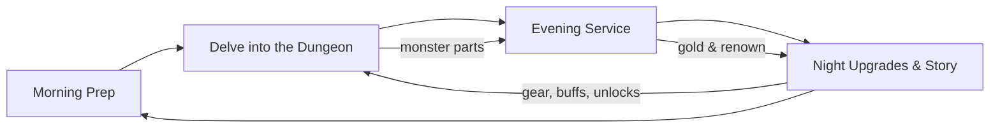

# HEARTHDELVE — Project Design Document

*Working title. Version 0.2 (top-down pivot, 2026-10-02). Engine: Unity 6.6, moving to 6.7 LTS on release.*

> **About this version.** Version 0.1 described a side-scrolling game in the style of Dead Cells. On 2026-10-02 the game pivoted to top-down. Sections rewritten for the pivot are marked **(rewritten in v0.2)**; the text they replace is kept in [Appendix B](#appendix-b-superseded-v01-side-scroller-design) rather than deleted. Sections without a mark are unchanged from v0.1. Where this document and `CLAUDE.md` disagree, `CLAUDE.md` wins.

---

## 1. Overview

### 1.1 Elevator Pitch (rewritten in v0.2)

You are the keeper of a small inn built atop the mouth of an ancient dungeon. By day you descend into **The Dungeons**, fighting room by room through top-down, hack-and-slash runs and harvesting the monsters you kill. By night you cook those parts into meals and pour brews for a growing crowd of patrons. The coin you earn buys better gear so you can delve deeper for rarer ingredients. As the dungeons begin to spill onto the surface, your inn grows the way a cult grows in *Cult of the Lamb*: from a quiet inn into a sanctuary, then a stronghold, and finally the rallying point of a world looking for a champion.

### 1.2 Genre and Inspirations (rewritten in v0.2)

Hybrid: top-down action roguelite + tavern management sim.

| Inspiration | What we take from it |
|---|---|
| *Cult of the Lamb* | The overall shape: short top-down combat runs feeding a home base that grows, with residents who have roles and moods |
| *Hades* | Combat feel: 8-direction movement, dodge with i-frames, light combo plus a heavy/charged attack; room-by-room runs where you pick the next room by its reward |
| *Moonlighter* | Dungeon by day, shop by night; what you carry out is what you sell |
| *Dave the Diver* | Minigame-driven cooking and service, a limited "oxygen" resource (our Essence), charming NPC cast |
| *Delicious in Dungeon* | Monsters as food, the ecology and "cookability" of creatures, how you kill something affecting how it tastes |
| *Warcraft / Lord of the Rings* | Classic high-fantasy world: humans, dwarves, elves, orcs, ancient evils, kingdoms under threat |

### 1.3 Design Pillars

1. **Every kill is a harvest.** Combat is not only about survival; *how* you fight determines what you bring home.
2. **Two halves, one loop.** The dungeon and the tavern feed each other constantly. Neither half should feel like a detour from the "real" game.
3. **A home that grows with you.** The tavern visibly transforms from a quiet inn into a fortified stronghold full of people you saved.
4. **Cozy on the surface, dread below.** The warmth of the tavern contrasts with the growing menace of the depths.
5. **You can feel it.** *(added in v0.2)* Every important moment lands through visuals, sound and haptics together.

### 1.4 Target Platform and Audience

- **Primary:** PC (Steam), plus a web build kept working throughout development. **Secondary:** Nintendo Switch 2, PlayStation 5, Xbox Series (post-launch consideration).
- **Input:** Controller-first design, full keyboard and mouse support.
- **Audience:** Players who enjoy action roguelites and cozy management games; fans of *Cult of the Lamb*, *Hades*, *Dave the Diver*, *Moonlighter*, *Potion Craft*, *Stardew Valley*.
- **Rating target:** Teen (fantasy violence, mild monster gore played for comedy).

---

## 2. World and Story

### 2.1 Setting

The world of **Aldmere** is a traditional high-fantasy continent: human kingdoms, dwarven holds carved into mountains, elven forests, orcish clans of the steppes, and wild borderlands between them. Ages ago a civilization delved too deep and sealed what it found beneath the earth. Those seals are failing.

**The Dungeons** are not ordinary caves. They are living, shifting underworlds that rearrange themselves (justifying procedural layouts). Each one grows outward and upward over time, and monsters from their depths are beginning to emerge onto the surface.

### 2.2 The Tavern

**The Sunken Flagon** sits in the frontier village of **Brackenford**, built directly over a dungeon entrance that locals treated as a curiosity. Adventurers used to stop in for a drink before exploring the shallow floors. The player inherits the tavern at the start of the game (see Act I).

### 2.3 The Protagonist

A retired (or reluctant) adventurer who has taken over the tavern. The protagonist is customizable (name, body, colours) with a fixed voice and personality. Default name for this document: **Bram Holloway**.

*(v0.2)* Customization is limited by the art: the player picks a body and recolours skin, hair and outfit through palette swaps. Layered outfits are not possible, because Minifantasy has no clothing or hair layers for attack animations.

### 2.4 Story Arc

The story unfolds in four acts, advanced by reaching dungeon depths and by tavern milestones (renown, sanctuary capacity).

**Act I — The Inn (Biomes 1–2).** Bram inherits the Sunken Flagon from a mentor who vanished in the dungeon. Business is slow. A wandering dwarf cook teaches Bram that monster meat, prepared right, is delicious. The first customers are adventurers and curious villagers. Hooks: the mentor's disappearance, strange carvings on the dungeon walls.

**Act II — The Sanctuary (Biomes 3–4).** Travelers bring news: other dungeons have opened across Aldmere. Monsters raid nearby farms. Refugees begin arriving at the tavern looking for food and safety. Bram expands the inn into a sanctuary with rooms, a wall, and space for newcomers. Some refugees have skills and join the tavern's workforce. The player learns the dungeons are connected beneath the world.

**Act III — The Stronghold (Biomes 5–6).** A neighboring kingdom falls. The tavern becomes one of the last safe places on the frontier. Soldiers, a disgraced knight, an elven scout and an orc warband arrive, uneasy allies. The tavern is fortified. Patrons now watch Bram's delves with hope; their morale becomes a mechanical force (see Section 6.4). Bram discovers what happened to his mentor.

**Act IV — The Champion (Biome 7 and the Heart).** The source of the dungeons is revealed at the deepest point beneath Brackenford. The whole stronghold rallies. A final descent culminates in a boss fight, with the people Bram fed and sheltered providing direct support. Post-game: endless/ascension mode and "legendary" ingredients.

### 2.5 Key Characters (Draft)

| Character | Role |
|---|---|
| **Bram Holloway** | Protagonist, tavern keeper and delver |
| **Gundra Ashbelly** (dwarf) | Head cook and mentor for cooking mechanics; gruff, obsessed with flavor |
| **Pip Marrowby** (halfling) | Server and bookkeeper; runs the floor during service |
| **Old Tamsin** | Former owner/mentor, missing in the dungeon; central mystery |
| **Ser Aldric Vane** | Disgraced knight who arrives in Act II; unlocks weapon training |
| **Sylvaris** (elf) | Herbalist and scout; unlocks herb garden and brewing depth |
| **Grukka Stonejaw** (orc) | Warband chief; blacksmith and fortification builder |
| **The Warden Below** | The intelligence behind the dungeons; antagonist |

---

## 3. Core Gameplay Loop

The loop is unchanged by the pivot.

### 3.1 The Day Cycle

Each in-game day is divided into four phases:

1. **Morning — Prep (Tavern hub).** Check stock, set the day's menu, eat a buff meal, choose gear, accept customer requests (e.g. "bring me cave troll liver").
2. **Day — The Delve (Dungeon).** A roguelite run. Fight, harvest, and choose when to return. Deeper = rarer ingredients and more risk.
3. **Evening — Service (Tavern).** Cook and serve using minigames. Earn gold, tips, and renown.
4. **Night — Upgrade (Tavern hub).** Spend earnings on equipment, tavern expansions, recipes, and staff. Story scenes play here. Save point.

### 3.2 Loop Diagram



### 3.3 How the Two Halves Feed Each Other

| From Dungeon to Tavern | From Tavern to Dungeon |
|---|---|
| Monster parts are ingredients | Gold buys weapons, armor, and tools |
| Harvest quality affects dish quality | Pre-delve meals grant run buffs |
| Rare parts unlock new recipes | Customer requests point you at specific monsters |
| Found recipe scraps and lore | Refugee staff unlock new dungeon abilities |
| Rescued NPCs join the tavern | Stronghold morale grants in-dungeon "Cheer" |

---

## 4. Dungeon Gameplay

### 4.1 Combat Feel (rewritten in v0.2)

Target feel is *Hades* and *Cult of the Lamb*: responsive, fast, readable top-down melee with strong hit feedback.

- **Movement:** 8-direction run; dodge roll with i-frames. No jumping.
- **Facing:** the art has four diagonal facings (front-right, front-left, back-right, back-left). Movement is 8-directional; the sprite shows the nearest facing.
- **Aim:** by movement direction on gamepad; by mouse on keyboard and mouse.
- **Attacks:** a light combo (three hits), a heavy/charged attack (hold to charge), two skill slots (tools/throwables), the **Harvest Finisher**, and the **Kitchen Arts** special (meter attack).
- **Feedback:** each hit plays one combined feedback: flash, a short freeze-frame, camera shake (subtle, adjustable), sound and a haptic pattern. Damage numbers are optional. Enemy attacks are clearly telegraphed.
- **Health:** Essence is the only health pool (Section 4.4).

### 4.2 Weapons as Kitchen Tools (rewritten in v0.2)

A signature flavor hook: many weapons are culinary, which ties weapon choice to harvesting. Weapon types now follow the attack animations Minifantasy provides (slash, thrust, swing, two-handed, ranged, guard, each with a charged version where available).

| Weapon Type | Example | Minifantasy animation | Harvest Specialty |
|---|---|---|---|
| Cleaver | Butcher's Cleaver | Slash (axe) | Clean cuts, bonus to meat quality |
| Filleting Blade | Eel-Tooth Knife | Slash (dagger) | Fast combos, perfect for fish/serpent parts |
| Skewer Spear | Rotisserie Pike | Thrust (spear, pitchfork) | Reach, pins enemies; "spit-roast" fire variant |
| Tenderizer | Troll-Mallet | Two-handed (waraxe) | Stagger damage, softens tough meats (bonus to stews). No mallet art exists; the waraxe stands in or is recoloured. |
| Frying Pan | Iron Skillet | Guard (buckler) | Parry/block weapon; counter hits sear enemies. No pan art exists; needs a small edit of the buckler. |
| Traditional | Sword, longsword, flail, whip, bow, slingshot | Slash, two-handed, swing, ranged | Standard harvest; wider combat variety |

Weapons have rarity tiers (Common → Fine → Masterwork → Legendary) and random affixes per run. Permanent unlocks add weapons to the drop pool. Elemental variants use the effect layers from *Magic Weapons And Effects*.

### 4.3 The Harvest System

The heart of the fantasy. How a monster dies influences what it drops. Unchanged by the pivot.

- **Clean Kill:** finishing with a matching tool type or a finisher move yields higher quality parts.
- **Overkill:** excessive damage (big explosions, over-hits) damages parts, lowering quality or destroying some.
- **Elemental Kills:** fire-killed monsters may drop "Seared" parts (pre-cooked, faster to prepare but some recipes need raw). Ice-killed monsters drop "Chilled" parts that stay fresh longer. Poison kills make parts inedible. Inedible parts still drop and can be carried; they will get a use later (a small sale value, poisons, or traps).
- **Harvest Finisher:** when an enemy is low, a prompt allows a quick finisher that guarantees a premium part at the cost of a moment of vulnerability. Risk/reward.

### 4.4 Essence, Inventory, Freshness, and Extraction

- **Essence:** delves are limited by Essence, which drains over time in the dungeon and drops when the player takes damage. At zero Essence the player is forced out (treated as a death). It is the only health pool. Max Essence and drain rate are upgradeable in the tavern.
- **The Satchel:** limited carry slots for ingredients (6 by default, stacks of up to 3), upgradeable in the tavern. Forces choices about what to keep. When it is full, picking up a part opens a swap prompt.
- **Freshness:** parts decay over time in the dungeon. Salt, ice runes, and preservation jars extend freshness.
- **Extraction:** the player can return via exit points (a rope or lift back to the tavern). Leaving early keeps everything; continuing deeper risks it.
- **Death:** the player loses the entire haul except one satchel slot they choose to keep (the Lockbox, the whole stack in it), and loses the day's unspent run currency. Permanent unlocks are never lost.

### 4.5 Field Cooking (Optional Mechanic)

At campfire rooms, the player can cook a quick meal from carried parts to restore Essence or grant a buff. This sacrifices ingredients that could be sold, creating a meaningful choice, and echoes the *Delicious in Dungeon* spirit.

### 4.6 Run Structure and Biomes (rewritten in v0.2)

**Runs are room by room.**

1. Enter a room; the doors lock.
2. Clear the room.
3. The doors unlock. Each door shows the **reward** of the room behind it.
4. Choose the next room by its reward.

Room rewards:

- **Ingredients** (a guaranteed part, or a room with a particular monster)
- **Gold**
- **Delve Marks**
- **A weapon**
- **A run power-up**, chosen from three

Floors are generated from a **room graph** (Section 10.5). Each biome has 3 floors plus a boss arena. Special rooms: campfire (field cooking), shop, extraction point.

**Biomes and their Minifantasy packs.** Only Biome 1 has been checked against the catalog in detail. The rest are provisional: the packs exist in our library, but their sheets have not been inspected yet. `docs/ASSET_MAP.md` holds the verified mapping.

| # | Biome | Theme | Environment packs | Creature candidates | Boss candidate |
|---|---|---|---|---|---|
| 1 | The Cellars | Old cellars and tunnels | Dungeon, More Dungeons, Dungeon Traps | Green Slime, Bat, Giant Spider, Skeleton, Mushroom People; Slime Cube as elite | Mother Slime |
| 2 | Fungal Warrens | Glowing fungal caves | Deep Caves, Glowing Mushrooms, Giant Mushrooms | Mushroom People, Blue Slime, Giant Snail, Necrofungus risen corpses | Open (no fungal boss found yet) |
| 3 | Goblin Sprawl | Goblin shanty-town and mines | Deep Caves, Old Mine Addon, Gold And Rock Nodes | Goblin, Goblin Raider, Goblin Sapper, Warg, Trasgo | Goblin King |
| 4 | Drowned Halls | Sunken dwarven ruins | Dwarven Kingdom, Shallow Water, Cenote | Frogfolk, Naga, Water Elemental, Octopurr | Kraken |
| 5 | Ember Forge | Volcanic dwarven forge | Lava Forge, Dungeon Lava Pit, Volcano | Magma Hound, Magma Golem, Fire Elemental, Imp, Burning Skull | Dragon or Balrog |
| 6 | Frostvault | Frozen crypts | Icy Wilderness, Ice Dungeon (More Dungeons) | Yeti, Wraith, Spectre, Skeleton, Evil Snowman | Lich or Ancient Troll |
| 7 | The Rootdeep | Living, pulsing underworld | Lost Civilization, The Void, Chamber Of Secrets | Tree Spirits, Beholder, Alien Bio Horror, Shoggoth's Avatar | The King In Yellow |
| — | The Heart | Final area | To be chosen | — | Demon Lord (as The Warden Below) |

Changes from v0.1 forced by the art: there is no rat with an attack, so the Giant Rat and the Cellar King are replaced in Biome 1; the Leviathan Eel becomes the Kraken; other v0.1 monsters without art (boar-riders, crab knights, salamanders, ice trolls) are replaced by the candidates above.

Branching between biomes lets players choose which ingredients to target on a given run.

### 4.7 Enemies and Bosses

Each enemy has a **combat profile** (behavior, attacks, telegraphs) and a **harvest profile** (parts, preferred kill method, freshness rate). Bosses drop signature ingredients that unlock "Legendary Dishes" and progress the story. Boss candidates per biome are in Section 4.6. Enemies are chosen from creatures that have idle, move, attack, damage and death animations.

---

## 5. Ingredients and Recipes

### 5.1 Ingredient Properties

Every ingredient is data-driven (ScriptableObject) with:

- **Category:** Meat, Offal, Fish, Fungus, Plant, Egg, Spice, Liquid, Magical.
- **Flavor Tags:** Savory, Sweet, Spicy, Sour, Bitter, Umami, Earthy, Arcane.
- **Quality:** Poor / Standard / Fine / Premium (from the Harvest system).
- **Freshness:** 0–100%, decays over time; affects dish score. Tracked per stack: when two stacks of the same part merge, freshness becomes the count-weighted average. Kitchens use the least-fresh stock first (on a tie, the lower quality first). Freshness is designed to also drop in the storeroom overnight, slowed by preservation upgrades (salt, ice runes, jars).
- **Rarity:** Common → Legendary; affects price.
- **Special Effects:** some ingredients carry buffs (e.g. a dragon heart grants fire resistance when eaten).

### 5.2 Example Ingredient Table

*(v0.2)* Ingredients follow the monster roster in Section 4.6. Icons come from the Minifantasy *Body Part Icons*, *Loot Icons* and food icon sets.

| Monster | Part | Category | Flavor | Notes |
|---|---|---|---|---|
| Green Slime | Gel | Liquid | Sweet | Used in jellies and drinks |
| Green Slime | Core | Magical | Arcane | Tonic ingredient |
| Bat | Wing | Meat | Savory | Staple early meat (replaces Rat Haunch) |
| Giant Spider | Leg | Meat | Savory, Umami | Premium when killed with a Cleaver |
| Giant Spider | Venom Sac | Offal | Bitter | Replaces Rat Liver |
| Mushroom People | Cap | Fungus | Earthy, Umami | Great in stews |
| Mushroom People | Spore Sac | Spice | Earthy | Seasoning |
| Dragon | Heart | Magical | Spicy, Arcane | Legendary dish ingredient |

### 5.3 Recipes

- Recipes are discovered through NPCs, recipe scraps found in the dungeon, customer hints, and experimentation.
- Each recipe has required ingredient slots (by category or specific item) and optional slots that add flavor tags and bonuses.
- **Experimentation:** combining ingredients freely at the "Test Kitchen" can discover new recipes. Failed experiments produce funny "Questionable Stew".
- Dish score = base recipe value × ingredient quality × freshness × minigame performance.
- *(v0.2)* Dish art comes from the Minifantasy food icon sets (*More Food Recipes* and others); dishes are named to fit the icons available.

---

## 6. Tavern Gameplay

### 6.1 Service Phase (rewritten in v0.2)

The tavern is a **top-down room the player walks around**. Customers enter, path to a free table, sit, and order from the menu the player set that morning. The player moves between stations to cook and pour, and **carries plates through the room** to the tables, avoiding people on the way. Staff help as they're unlocked. Service lasts a fixed time (currently 2.5 minutes, tuned in playtesting).

The cooking minigames stay as **screen panels** that open over the room when the player uses a station.

### 6.2 Minigames

Each station is a short, skill-based minigame. Staff can auto-complete stations at reduced quality so the player can focus on others.

| Station | Minigame | Skill |
|---|---|---|
| **Butcher Block** | Follow cut lines on a monster part; accuracy sets portion count | Precision |
| **Grill / Pan** | Flip at the right moment; watch a doneness meter | Timing |
| **Stew Pot** | Chop ingredients; the pot simmers on its own | Precision/management |
| **Oven** | Set heat and pull at the right time while multitasking | Timing |
| **Tap & Brew** | Pour ale/mead to the line with correct foam; mix cocktails and potions | Precision |
| **Plating** | Arrange garnish quickly for presentation bonus | Speed |
| **Serving** | Carry plates through the room; collisions fill a spill meter | Movement |
| **Bouncer** | Rowdy customers occasionally brawl; quick combat-lite minigame to throw them out | Reflex |

Additional minigames can be introduced over time (fermentation, bread proofing, spice grinding) to keep service fresh through the campaign. Each minigame's haptics are described in Section 9A.

### 6.3 Customers

- **Types:** villagers, adventurers, dwarves, elves, orcs, merchants, nobles, refugees, and eventually soldiers and heroes.
- **Preferences:** each race/type has favorite flavor tags and categories (e.g. dwarves love savory and strong ale; elves prefer herbs and fungus; orcs demand big meat portions).
- **Patience:** a timer; slow service lowers tips and reviews.
- **Special Guests:** named characters with unique requests that drive story, unlock recipes, or give quests.
- **Reviews and Renown:** satisfied customers raise the tavern's Renown, which attracts better-paying clientele and unlocks story beats.
- *(v0.2)* Customers are built from the layered *A Myriad Of NPCs* characters, which gives a large variety of bodies, outfits and hair.

### 6.4 The Growing Stronghold (rewritten in v0.2)

The inn plays the role the cult plays in *Cult of the Lamb*. It grows across the acts from a small inn into a stronghold.

| Stage | Name | Adds |
|---|---|---|
| 1 | The Inn | Kitchen, bar, small dining room |
| 2 | The Sanctuary | Guest rooms, refugee quarters, herb garden, storeroom |
| 3 | The Stronghold | Walls, watchtower, forge, training yard, brewery, great hall |
| 4 | The Bastion | War room, shrine, feast hall for the finale |

- **Areas** unlock through story and upgrades.
- **Furniture and decor** are placed freely inside unlocked areas. Decor raises customer satisfaction.
- **No freeform construction** (placing walls and rooms) for now, but nothing should be designed in a way that rules it out later.
- Art: *Tavern Indoor*, *Towns*, *Towns 2*, *Crafting And Professions I/II* (kitchen, preparation table and other workbenches), *Farm*, *Castles And Strongholds*, *Builders*.

**Residents:** refugees who move in can be assigned roles (cook, server, gardener, smith, guard). Each resident has a small personal questline.

**Morale and Cheer:** the stronghold has a Morale value driven by food quality, housing, and story events. High morale grants **Cheer** in the dungeon: temporary buffs, extra revives, or crowd "chants" that power up the Kitchen Arts meter. This makes the story theme of people rallying behind you a real mechanic.

**Defense Events (undecided):** occasionally monsters breach the surface and attack the stronghold, and the player defends with residents helping. Not built yet. Because the tavern now uses the same top-down character as the dungeon, adding them later is cheap.

---

## 7. Progression and Economy

### 7.1 Currencies

| Currency | Earned From | Spent On |
|---|---|---|
| **Gold** | Service, selling surplus ingredients, gold rooms | Gear, tavern upgrades, recipes, staff wages |
| **Renown** | Customer satisfaction, story | Unlocks tiers of customers, story progress (not spent) |
| **Delve Marks** | Found in dungeon runs (lost on death if unspent) | Permanent combat unlocks at the "Delver's Board" |
| **Relics** | Bosses, secrets | Major permanent abilities |

### 7.2 Upgrade Tracks

- **Combat:** weapon blueprints (added to drop pools), armor, satchel size, preservation tools, Essence Tonics.
- **Run power-ups:** *(v0.2)* temporary boons chosen one-of-three in power-up rooms; they last for the run.
- **Relics:** permanent abilities that open shortcuts and hidden rooms. *(v0.2: no longer platforming abilities such as double jump.)*
- **Tavern:** stations, furniture, seating capacity, decor, new areas.
- **Staff:** hire and train residents; staff skill levels affect auto-complete quality.

### 7.3 Economy Balance Goals

- A good delve should fund roughly one meaningful upgrade.
- Selling raw ingredients should be viable but noticeably worse than cooking them.
- Staff wages and refugee upkeep create light pressure without becoming a punishing survival mechanic.

---

## 8. Art and Audio Direction

### 8.1 Visual Style (rewritten in v0.2)

All art is **Minifantasy** by Krishna Palacio: tiny top-down pixel art on an 8×8 grid.

- **Resolution:** 320×180 reference at 8 pixels per unit; 1 world unit = 1 tile = 8 px. Pixel Perfect Camera. To be confirmed in the 4a look test.
- **Characters:** 32×32 frames with a body of about 8×8, four diagonal facings.
- **Sorting:** sprites sort by Y position, with pivots at the feet.
- **Palette:** warm, saturated tavern (amber candlelight, wood, hearth) against cool, eerie dungeons (teal, violet, bioluminescence), using URP 2D lights.
- **Food** should look appetizing even at this scale; dishes use the Minifantasy food icons, shown enlarged in menus and results.
- **Content adapts to the art:** monsters, ingredients, dishes, stations, NPCs and bosses are chosen from what Minifantasy contains (`docs/ASSET_MAP.md`).
- **Known gaps:** no rat with an attack, no mallet or frying pan weapon, no plate-carrying overlay, and no fonts or audio.

### 8.2 UI (rewritten in v0.2)

Rustic fantasy UI built with uGUI, **Super Text Mesh** for all text, and Minifantasy UI sprites (*User Interface*, *UI Overhaul*: panels, speech bubbles, emotion icons, controller glyphs). Readable during fast combat, with a minimal HUD in the dungeon. All text is localized.

### 8.3 Audio

- **Tavern:** folk instrumentation (fiddle, lute, accordion, bodhrán); music gains layers as the tavern grows and more residents join in.
- **Dungeon:** darker, percussive, biome-specific themes that intensify in combat.
- **SFX:** chunky, satisfying combat impacts; sizzling, chopping, pouring, and crowd chatter in the tavern.
- **Voice:** grunts and barks ("Hmm!", "Aye!") rather than full voice acting, for scope.
- *(v0.2)* No audio source exists yet. Generated placeholder sounds are used until real SFX and music are sourced.

---

## 9. Controls (rewritten in v0.2)

| Action | Gamepad | Keyboard and mouse |
|---|---|---|
| Move | Left stick | W A S D |
| Aim | Movement direction | Mouse |
| Light attack (combo) | X / Square | Left mouse |
| Heavy / charged attack (hold) | Y / Triangle | Right mouse |
| Dodge roll | B / Circle | Space |
| Interact / pick up / use station / serve | A / Cross | E |
| Skills 1 and 2 | LB / RB | 1 / 2 |
| Kitchen Arts special | RT | Q |
| Harvest Finisher | LT | F |
| Pause | Start | Esc |

In the tavern the same character controls apply (move, interact); attacks are disabled. Minigames use their own actions (minigame action on X / left mouse, alternate on Y, cancel on B / Esc).

All controls are remappable via the Unity Input System.

## 9A. Haptics (new in v0.2)

Haptics are a core part of game feel, designed in from the start.

**Principles**

- **A vocabulary of named patterns.** Gameplay triggers named patterns, never raw motor values. Patterns are data (ScriptableObjects).
- **Authored with visuals and sound.** Each important moment has one combined feedback containing all three.
- **Pure, tested mappings.** Any mapping from a gameplay value to intensity (e.g. pour speed → rumble strength) is plain logic with unit tests.
- **Player control.** Vibration on/off and an intensity slider apply globally, plus a reduced-intensity accessibility option. Vibration defaults to on when a supported controller is connected.
- **Graceful degradation.** Where rumble is unsupported (no controller, web builds, some controllers), haptics do nothing and nothing else changes.

**Starting vocabulary** (a gamepad has a low motor for heavy thuds and a high motor for light buzz)

| Pattern | Shape | Used for |
|---|---|---|
| `Tap.Light` | High, very short | Grill flip, UI confirm, pickup |
| `Tap.Firm` | Both, short | Light hit landed, clean cut |
| `Hit.Heavy` | Low-dominant, medium, quick decay | Heavy/charged hit, enemy slam |
| `Hit.Taken` | Low, sharp, short tail | Player damaged |
| `Kill.Clean` | Firm tap, then a rising high tick | Clean-kill cue |
| `Finisher.Harvest` | Low build-up, pause, strong double pulse | Harvest Finisher |
| `Pulse.Success` | Two rising high pulses | Perfect flip, perfect pour |
| `Buzz.Failure` | Rough low buzz | Overflow, burnt, dropped plate |
| `Cue.Threshold` | Single crisp high tick | Foam reaches the line |
| `Bump.Soft` / `Bump.Hard` | Low, short; strength by spill meter | Serving collisions |
| `Cut.Ragged` | Two uneven low ticks | Butcher Block miss |
| `Heartbeat.Warning` | Low double-beat, looping, rate rises | Low Essence |
| `Boss.Telegraph` / `Boss.PhaseChange` | Slow low swell / long rumble with a peak | Boss attacks and phases |
| `Rumble.Continuous` | Level set each frame, 0–1 | Pour speed, grill nearing burn |

**Cooking minigames**

- **Grill:** a tap on each flip; a rising rumble as doneness nears the burn zone; a success pulse for a perfect flip.
- **Tap:** a continuous rumble that scales with pour speed; a distinct cue as foam reaches the line; a failure buzz on overflow.
- **Serving:** a bump pulse on collisions, intensifying as the spill meter fills.
- **Butcher Block:** a cue for each cut, with clean cuts feeling different from ragged ones.

**Dungeon**

- Light hits versus heavy hits.
- A distinct, satisfying clean-kill cue.
- The Harvest Finisher.
- Damage taken.
- A warning heartbeat at low Essence.
- Boss attacks and phase changes.

**Platform support** (expected; to be tested on hardware): Xbox controllers on PC; DualShock 4 and DualSense over USB; no rumble for Switch Pro on PC unless remapped by Steam Input; no rumble in web builds.

---

## 10. Technical Design (rewritten in v0.2)

Unity 6.6 now, moving to 6.7 LTS when it is released and staying there through launch.

### 10.1 Engine Configuration and Third-Party Assets

- **Render Pipeline:** URP with the 2D Renderer and 2D lights. Pixel Perfect Camera at 320×180, 8 PPU. Custom transparency sort axis (0, 1, 0).
- **TopDown Engine 5.0 (TDE):** character controller, abilities (movement, dash, weapons), combat, enemy AI, camera and rooms. It replaces the custom kinematic controller.
- **MMFeedbacks / MMTools** (bundled with TDE): all game feel. There is only one copy; Feel's copies are never imported.
- **Nice Vibrations** (from Feel): haptics.
- **Super Text Mesh (STM):** all player-facing text, in uGUI and world space, with its Ultra shader under URP.
- **Input:** Input System with separate action maps (`Dungeon`, `Tavern`, `UI`, `Minigame`) and runtime rebinding. TDE reads input through a subclass of its `InputSystemManager` that maps our Dungeon and Tavern maps onto TDE's buttons.
- **Camera:** Cinemachine 6.6 (TDE's Cinemachine 3 code path), room confiners, impulse-based shake.
- **UI:** uGUI + STM + Minifantasy UI sprites. UI Toolkit is no longer used.
- **Animation:** sprite-sheet animation, clips generated from the Minifantasy sheets and their frame-duration guides.
- **Physics:** Physics 2D with no gravity.
- **Pathfinding:** our own grid A* (TDE has none for 2D).
- **Content Loading:** Addressables for biome assets and room prefabs when room loading is built; until then only Localization uses it.
- **Localization:** Unity Localization package; every player-facing string comes from a string table.
- **Dialogue:** Yarn Spinner with an STM dialogue presenter.

Versions, licenses and vendor rules are in `docs/THIRD_PARTY.md` and `CLAUDE.md`.

### 10.2 Scene Structure

- `Boot` — initializes services (save, audio, input, localization, haptics) and persists.
- `MainMenu`
- `Tavern` — hub scene for Prep, Service, and Night phases.
- `Dungeon` — single scene into which biome rooms are loaded.
- `Cutscene` scenes as needed (or Timeline sequences inside Tavern).

Additive scene loading keeps the persistent `Boot` services alive.

### 10.3 Architecture Overview

- **Data-driven design with ScriptableObjects:** `IngredientDefinition`, `RecipeDefinition`, `EnemyDefinition`, `WeaponDefinition`, `CustomerProfile`, `BiomeDefinition`, `RoomDefinition`, `TavernUpgradeDefinition`, plus haptic patterns.
- **Pure logic in plain C#** with EditMode tests: Essence, harvest rules, inventory, freshness, recipes, economy, service session, customer order and patience logic, staff, game flow, saving, pathfinding, haptic intensity mapping. TDE-dependent behaviour gets PlayMode tests.
- **Game flow:** `GameFlow` drives phases (Prep → Delve → Service → Night) and scene transitions.
- **Event bus:** a lightweight event bus decouples systems. TDE and MoreMountains events are **bridged onto our bus at the boundary** rather than used throughout our code.
- **Characters:** the player, enemies, customers and staff are TDE characters. Our behaviour is added through subclasses, composition and TDE abilities in our own assemblies; vendor code is never modified.
- **Essence and health:** Essence is the only health pool, implemented as a subclass of TDE's `Health` backed by `EssenceMeter`.
- **Combat:** TDE weapons and damage areas, with our damage pipeline (element, overkill) and harvest rules reading the kill context.
- **Minigames:** each station implements `IMinigame` (Begin, Tick, Evaluate → score 0–1), so staff can auto-resolve any station.
- **Customer AI:** a state machine (Enter, Queue, Seat, Order, Wait, Eat, Pay, Leave) with a patience timer and preference scoring; movement follows A* paths to tables.
- **Feedbacks:** one `MMF_Player` per important moment, containing visuals, sound and a named haptic pattern. All intensities respect the player's settings.

### 10.4 Key Systems

| System | Responsibility |
|---|---|
| `HarvestSystem` | Determines drops from kill context (weapon type, element, overkill) |
| `InventorySystem` | Satchel, storeroom, freshness decay, preservation modifiers |
| `RecipeSystem` | Recipe matching, experimentation, dish scoring |
| `ServiceSystem` | Customer spawning, orders, timers, payment, reviews |
| `EconomySystem` | Currencies, prices, wages |
| `ProgressionSystem` | Unlocks, relics, tavern stages, story flags |
| `StoryManager` | Act progression, dialogue triggers (Yarn Spinner) |
| `SaveSystem` | Versioned JSON of persistent state; autosave at Night phase |
| `LevelGenerator` | Builds dungeon floors from room graphs |
| `HapticService` | Plays named haptic patterns, applies settings, checks device support |
| `GridPathfinder` | A* on the room's tile grid for customers and enemies |

### 10.5 Procedural Level Generation

Designer-authored **room prefabs** chosen by a **graph-based generator**, played one room at a time.

1. Each biome defines a floor template graph (entrance, combat rooms, reward rooms, campfire, shop, extraction, boss).
2. The generator picks a room prefab for each node by type and door layout, and assigns each room a reward.
3. Each exit door shows the reward of the room it leads to.
4. Enemies and loot spawn from weighted tables per biome and depth.
5. Seeds are stored for debugging and potential daily-challenge modes.

### 10.6 Save Data

Persistent: tavern stage and upgrades, placed furniture, unlocked weapons/relics/recipes, storeroom inventory, currencies, residents, story flags, settings. Run state is saved only at biome transitions to prevent save-scumming (optionally allow a "suspend run" save).

### 10.7 Project Folder Structure

```
Assets/
  _Project/
    Art/            (our own edits and placeholders)
    Audio/          (Music, SFX)
    Data/           (Ingredients, Recipes, Enemies, Weapons, Biomes, Customers, Haptics)
    Dialogue/       (.yarn files)
    Prefabs/        (Player, Enemies, Rooms, Tavern, UI)
    Scenes/
    Scripts/
      Core/         (Events, Services, Input, Pathfinding)
      Dungeon/      (Combat, Enemies, Harvest, Essence, Run)
      Tavern/       (Service, Customers, Minigames, Staff)
      Shared/       (Game flow, Inventory, Economy, Progression, Save)
      UI/
      Editor/
    Settings/       (Input actions)
    Localization/
    Tests/
  ThirdParty/
    Minifantasy/    (imported packs, only what we need)
  TopDownEngine/    (vendor, default folder)
  Clavian/          (Super Text Mesh, default folder)
  Feel/             (Nice Vibrations only, default folder)
```

---

## 11. Scope and Milestones

### 11.1 Development Phases

| Phase | Goal | Contents |
|---|---|---|
| **1. Prototype: Combat** | Prove the dungeon feels good | Done as a side-scroller (see tag `v0-sidescroller-prototype`) |
| **2. Prototype: Tavern** | Prove service is fun | Done as a side-scroller |
| **3. Loop Prototype** | Prove the halves connect | Done as a side-scroller |
| **4. Vertical Slice** | Represent final quality, top-down | Biome 1 fully arted + boss, Stage 1 tavern polished, Act I opening story |
| **5. Production** | Content build-out | Biomes 2–7, all minigames, stronghold stages, full story |
| **6. Polish and Launch** | Ship | Balance, accessibility, localization, performance, platform certification |

**Phase 4 sub-milestones** *(v0.2)*. Each is planned, approved, built and playtested separately; the web build works at the end of each.

- **4a Integration and look test:** project swap, port manifest, logic and tests ported, Nice Vibrations, Minifantasy import pipeline, one dungeon room and one tavern corner with real art, `docs/ASSET_MAP.md`.
- **4b Dungeon migration:** Phase 1 and 3 dungeon gameplay rebuilt on TDE, with the dungeon haptics.
- **4c Tavern and UI migration:** top-down tavern, customer pathing, 2D serving, Grill/Tap/Serving with haptics, all UI in uGUI + STM.
- **4d Biome 1 runs:** room-by-room structure, room rewards, run power-ups, 3 floors plus a boss arena.
- **4e Combat depth and boss:** Harvest Finisher, Kitchen Arts, 3–4 more weapons with rarity and affixes, Essence Tonics, field cooking, Delve Marks and the Delver's Board, one relic, the Biome 1 boss.
- **4f Tavern Stage 1 content:** Butcher Block, all Biome 1 recipes, customer requests, Pip and Gundra, furniture and decor placement.
- **4g Story and character creation:** Yarn Spinner with an STM dialogue presenter, the Act I opening, onboarding.
- **4h Menus, options and polish:** settings (screen shake, flash and vibration intensity), accessibility per Section 12, audio system, web build.

### 11.2 Scope Warning

Two full games in one is ambitious, especially for a small team. Recommended guardrails: keep minigames short and reusable; build a strong, small vertical slice before expanding; consider Early Access with 3–4 biomes and the first two tavern stages, adding later acts in updates.

---

## 12. Accessibility

- Remappable controls, hold/toggle options.
- Adjustable combat speed and "assist mode" (damage taken, freshness decay, customer patience).
- Minigame assist: wider timing windows or auto-complete.
- Colorblind-safe telegraphs and freshness indicators (use shapes/icons, not color alone).
- Screen shake and flash intensity sliders; text size options.
- *(v0.2)* Vibration on/off, a vibration intensity slider, and a reduced-intensity option. No gameplay information is conveyed by haptics alone.

---

## 13. Decisions and Open Questions

**Decided**

1. **Art style:** pixel art, Minifantasy (8×8, top-down).
2. **Perspective:** top-down *(v0.2)*.
3. **Protagonist:** customizable through body choice and palette swaps.
4. **Time pressure:** no calendar deadline. Delves are limited by Essence, which depletes over time and when the player takes damage, and can be upgraded.
5. **Death penalty:** lose everything except one satchel slot the player chooses to keep.
6. **Co-op:** no.
7. **Dialogue tooling:** Yarn Spinner.
8. **Monetization:** premium only, with possible paid expansions.

**Open**

1. **Stronghold defense events:** core feature or post-launch?
2. **Biome 2 boss:** no fungal boss found in the art yet.
3. **Audio source:** where SFX and music come from.
4. **Font:** a pixel font for Super Text Mesh.
5. **Freeform construction:** not planned, but kept possible.

---

## 14. Appendix A: Glossary

- **Delve:** a single roguelite run into the dungeon.
- **Essence:** the delve timer and the player's only health pool.
- **Haul:** ingredients carried back from a delve.
- **Harvest Finisher:** a special kill move that guarantees a premium part.
- **Kitchen Arts:** the player's special meter attack.
- **Cheer:** in-dungeon buffs granted by stronghold morale.
- **Renown:** the tavern's reputation, driving customer tiers and story.
- **Satchel / Lockbox:** carry inventory / the one slot kept on death.
- **Run power-up:** a temporary boon chosen from three, lasting one run.
- **Haptic pattern:** a named vibration design triggered by gameplay.

---

## Appendix B: Superseded v0.1 side-scroller design

Kept for reference. None of this describes the current game. The playable prototype built from it is at the tag `v0-sidescroller-prototype`.

### B.1 Elevator pitch (v0.1)

"…By day you descend into The Dungeons, carving through monsters in fast, **side-scrolling** hack-and-slash runs, harvesting their parts…"

### B.2 Genre and inspirations (v0.1)

Hybrid: side-scrolling action roguelite + restaurant/tavern management sim. *Dead Cells* was the main combat inspiration: fluid 2D melee combat, weapon variety, procedurally stitched levels, run-based structure with persistent unlocks. Target audience listed fans of *Dead Cells*.

### B.3 Combat feel (v0.1, Section 4.1)

Target feel was *Dead Cells*: responsive, fast, readable, with heavy hit-stop and satisfying animation canceling.

- **Movement:** run, jump, double jump (unlockable), dodge roll with i-frames, wall slide/jump, drop-through platforms, ledge grab.
- **Attacks:** primary weapon (combo chains), secondary weapon or shield, two skill slots (tools/throwables), and a special "Kitchen Arts" meter attack.
- **Feedback:** hit-stop, screen shake (subtle, toggleable), damage numbers (toggleable), clear enemy telegraphs.

### B.4 Weapons (v0.1, Section 4.2)

Cleaver (Butcher's Cleaver), Filleting Blade (Eel-Tooth Knife), Tenderizer (Troll-Mallet), Skewer Spear (Rotisserie Pike), Frying Pan (Iron Skillet), Traditional (swords, axes, bows, staves). Random affixes per run, "*Dead Cells* style".

### B.5 Death (v0.1, Section 4.4)

"On death, the player keeps a portion of the haul (e.g. items in a protected 'Lockbox' slot plus a percentage of the rest)…" Replaced before the pivot by the one-slot Lockbox rule.

### B.6 Run structure and biomes (v0.1, Section 4.6)

Levels were assembled from hand-authored rooms stitched together procedurally into continuous side-scrolling levels; each biome had 3–5 floors plus a boss, with branching paths between biomes as in *Dead Cells*.

| # | Biome | Theme | Signature Ingredients |
|---|---|---|---|
| 1 | The Cellars | Flooded old cellars and tunnels | Giant rats, slimes, cave mushrooms |
| 2 | Fungal Warrens | Glowing fungal forest | Myconids, spore beetles, walking truffles |
| 3 | Goblin Sprawl | Goblin shanty-town and mines | Boar-riders, cave boars, stolen spices |
| 4 | Drowned Halls | Sunken dwarven ruins | Giant eels, crab knights, kelp horrors |
| 5 | Ember Forge | Volcanic dwarven forge | Salamanders, fire drakes, magma snails |
| 6 | Frostvault | Frozen crypts | Ice trolls, wyrm eggs, frost wraiths |
| 7 | The Rootdeep | Living, pulsing underworld | Aberrations, dragon cuts, legendary parts |

Example bosses: *The Cellar King* (giant rat monarch), *Grandmother Spore* (myconid matriarch), *Chieftain Gutgrin* (goblin warlord on a war boar), *The Leviathan Eel*, *Forge-Drake Cindermaw*, *The Frost Troll Queen*, *The Warden Below* (final).

### B.7 Example ingredients (v0.1, Section 5.2)

Giant Rat Haunch (Meat, Savory), Green Slime Gel (Liquid, Sweet), Myconid Cap (Fungus, Earthy/Umami), Cave Boar Belly (Meat, Savory), Giant Eel Fillet (Fish, Umami), Salamander Tail (Meat, Spicy), Ice Troll Liver (Offal, Bitter), Fire Drake Heart (Magical, Spicy/Arcane).

### B.8 Service phase and defense events (v0.1, Sections 6.1 and 6.4)

"During evening service the camera shows the tavern floor and kitchen in a **side view**…" The player moved between stations along one axis. Defense events were described as "a short side-scrolling combat encounter".

### B.9 Visual style (v0.1, Section 8.1)

Two options were open: high-res hand-painted 2D with skeletal animation, or detailed pixel art in the spirit of *Dead Cells* and *Dave the Diver*. The prototype used pixel-art placeholders at 640×360 and 32 PPU. UI was planned in UI Toolkit.

### B.10 Controls (v0.1, Section 9)

| Action | Dungeon | Tavern |
|---|---|---|
| Left Stick | Move | Move between stations |
| A / Cross | Jump | Interact / confirm |
| X / Square | Primary attack | Minigame action |
| Y / Triangle | Secondary attack | Minigame alt action |
| B / Circle | Dodge roll | Cancel / back |
| LB / RB | Skills 1 and 2 | Cycle orders |
| RT | Kitchen Arts special | Speed up (hold) |
| LT | Harvest finisher | — |
| Start | Pause menu | Pause menu |

### B.11 Technical design (v0.1, Section 10)

Unity 6.3 LTS. UI Toolkit for menus and HUD, with uGUI only for world-space UI. 2D Animation package (or Spine) for skeletal characters. Physics 2D with a **custom kinematic character controller** for tight platforming. Character state machine: Idle, Run, Jump, Fall, Dodge, Attack, Hurt, Dead, with frame-data-driven attacks. Hitbox/hurtbox components and hit-stop via a time-scale service. Level generation "similar to *Dead Cells*": room prefabs placed on a grid with connection validation to avoid overlap. Relics granted traversal abilities (double jump, dash).
